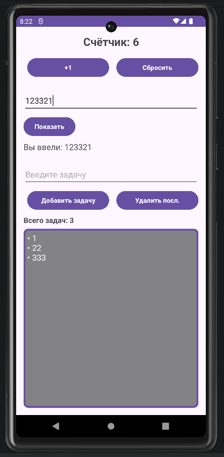

<div align="center">

**МИНИСТЕРСТВО НАУКИ И ВЫСШЕГО ОБРАЗОВАНИЯ РОССИЙСКОЙ ФЕДЕРАЦИИФЕДЕРАЛЬНОЕ ГОСУДАРСТВЕННОЕ БЮДЖЕТНОЕ ОБРАЗОВАТЕЛЬНОЕ УЧРЕЖДЕНИЕ ВЫСШЕГО ОБРАЗОВАНИЯ**  
**«САХАЛИНСКИЙ ГОСУДАРСТВЕННЫЙ УНИВЕРСИТЕТ»**

<br>
<br>

Институт естественных наук и техносферной безопасности  
Кафедра информатики  
Ощепков Алексей

<br>
<br>
<br>
<br>

Лабораторная работа №5  
«Счетчик нажатий, поле ввода и отображение текста. Реализация ToDo-списка.»  
01.03.02 Прикладная математика и информатика  

<br>
<br>
<br>
<br>
<br>
<br>
<br>
<br>
<br>
<br>
<br>
<br>
<br>

<div align="right">
Научный руководитель<br>
Соболев Евгений Игоревич
</div>

<br>
<br>
<br>

г. Южно-Сахалинск  
2026 г.

</div>

---

# Л/р №5

## Счетчик нажатий, поле ввода и отображение текста. Реализация ToDo-списка.

**Цель работы:** Научиться обрабатывать пользовательский ввод, работать с состоянием (счетчик, список задач), динамически обновлять интерфейс приложения на Kotlin.

---

## 1. Листинг `activity_main.xml` и `MainActivity.kt`.

Листинг `activity_main.xml`.

```kotlin
<?xml version="1.0" encoding="utf-8"?>
<LinearLayout
    xmlns:android="http://schemas.android.com/apk/res/android"
    android:id="@+id/main"
    android:layout_width="match_parent"
    android:layout_height="match_parent"
    android:orientation="vertical"
    android:padding="16dp">

    <!-- счётчик -->
    <TextView
        android:id="@+id/textCounter"
        android:layout_width="match_parent"
        android:layout_height="wrap_content"
        android:text="@string/counter_text"
        android:textSize="24sp"
        android:textStyle="bold"
        android:gravity="center"
        android:layout_marginBottom="16dp"/>

    <!-- Контейнер для кнопок счётчика -->
    <LinearLayout
        android:layout_width="match_parent"
        android:layout_height="wrap_content"
        android:orientation="horizontal"
        android:layout_marginBottom="24dp"
        style="?android:attr/buttonBarStyle">

        <Button
            android:id="@+id/buttonIncrement"
            style="?android:attr/buttonBarButtonStyle"
            android:layout_width="0dp"
            android:layout_height="wrap_content"
            android:layout_weight="1"
            android:text="@string/button_increment"
            android:layout_marginEnd="8dp"
            android:backgroundTint="@color/purple"
            android:textColor="@color/white"
            android:textStyle="bold"/>

        <Button
            android:id="@+id/buttonReset"
            style="?android:attr/buttonBarButtonStyle"
            android:layout_width="0dp"
            android:layout_height="wrap_content"
            android:layout_weight="1"
            android:text="@string/button_reset"
            android:backgroundTint="@color/purple"
            android:textColor="@color/white"
            android:textStyle="bold"/>
    </LinearLayout>

    <!-- поле ввода для отображения текста -->
    <EditText
        android:id="@+id/editTextInput"
        android:layout_width="match_parent"
        android:layout_height="wrap_content"
        android:hint="@string/hint_input_text"
        android:inputType="text"
        android:layout_marginBottom="8dp"
        android:minHeight="48dp"/>

    <Button
        android:id="@+id/buttonShow"
        android:layout_width="wrap_content"
        android:layout_height="wrap_content"
        android:text="@string/button_show"
        android:layout_marginBottom="8dp"
        android:backgroundTint="@color/purple"
        android:textColor="@color/white"
        android:textStyle="bold"
        android:minWidth="48dp"
        android:minHeight="48dp"/>

    <TextView
        android:id="@+id/textEntered"
        android:layout_width="wrap_content"
        android:layout_height="wrap_content"
        android:text="@string/label_entered"
        android:textSize="18sp"
        android:layout_marginBottom="24dp"/>

    <!-- Список -->
    <EditText
        android:id="@+id/editTextTask"
        android:layout_width="match_parent"
        android:layout_height="wrap_content"
        android:hint="@string/hint_input_task"
        android:inputType="text"
        android:layout_marginBottom="8dp"
        android:minHeight="48dp"/>

    <!-- Контейнер для кнопок списка -->
    <LinearLayout
        android:layout_width="match_parent"
        android:layout_height="wrap_content"
        android:orientation="horizontal"
        android:layout_marginBottom="8dp"
        style="?android:attr/buttonBarStyle">

        <Button
            android:id="@+id/buttonAddTask"
            style="?android:attr/buttonBarButtonStyle"
            android:layout_width="0dp"
            android:layout_height="wrap_content"
            android:layout_weight="1"
            android:text="@string/button_add_task"
            android:layout_marginEnd="8dp"
            android:backgroundTint="@color/purple"
            android:textColor="@color/white"
            android:textStyle="bold"/>

        <Button
            android:id="@+id/buttonRemoveLast"
            style="?android:attr/buttonBarButtonStyle"
            android:layout_width="0dp"
            android:layout_height="wrap_content"
            android:layout_weight="1"
            android:text="@string/button_remove_last"
            android:backgroundTint="@color/purple"
            android:textColor="@color/white"
            android:textStyle="bold"/>
    </LinearLayout>

    <!-- Инд №2 Счетчик задач -->
    <TextView
        android:id="@+id/textTaskCount"
        android:layout_width="wrap_content"
        android:layout_height="wrap_content"
        android:text="@string/task_count_label"
        android:textSize="16sp"
        android:textStyle="bold"
        android:layout_marginBottom="8dp"/>

    <ScrollView
        android:layout_width="match_parent"
        android:layout_height="0dp"
        android:layout_weight="1"
        android:fillViewport="true">

        <!-- Список задач -->
        <TextView
            android:id="@+id/textTasks"
            android:layout_width="match_parent"
            android:layout_height="wrap_content"
            android:text="@string/label_tasks"
            android:textSize="18sp"
            android:background="@drawable/border_purple"
            android:textColor="@color/white"
            android:padding="8dp"
            android:gravity="top|start"/>
    </ScrollView>
</LinearLayout>
```

Листинг `MainActivity.kt`

```kotlin
package com.example.todoapp

import android.os.Bundle
import android.widget.Button
import android.widget.EditText
import android.widget.TextView
import android.widget.Toast
import androidx.appcompat.app.AppCompatActivity

class MainActivity : AppCompatActivity() {

    private var counter = 0
    private val tasks = mutableListOf<String>()

    //Инд №2 Счетчик количества задач
    private var taskCount = 0

    override fun onCreate(savedInstanceState: Bundle?) {
        super.onCreate(savedInstanceState)
        setContentView(R.layout.activity_main)

        //Инициализация

        //Счётчик
        val textCounter = findViewById<TextView>(R.id.textCounter)
        val buttonIncrement = findViewById<Button>(R.id.buttonIncrement)
        val buttonReset = findViewById<Button>(R.id.buttonReset)

        //Ввод текста
        val editTextInput = findViewById<EditText>(R.id.editTextInput)
        val buttonShow = findViewById<Button>(R.id.buttonShow)
        val textEntered = findViewById<TextView>(R.id.textEntered)

        //ToDо список
        val editTextTask = findViewById<EditText>(R.id.editTextTask)
        val buttonAddTask = findViewById<Button>(R.id.buttonAddTask)
        val buttonRemoveLast = findViewById<Button>(R.id.buttonRemoveLast)
        val textTasks = findViewById<TextView>(R.id.textTasks)

        //Инд №2 Счетчик задач
        val textTaskCount = findViewById<TextView>(R.id.textTaskCount)


        //Счётчик нажатий
        updateCounterDisplay(textCounter)

        buttonIncrement.setOnClickListener {
            counter++
            updateCounterDisplay(textCounter)
        }

        // Сброс счётчика
        buttonReset.setOnClickListener {
            counter = 0
            updateCounterDisplay(textCounter)
            Toast.makeText(this, R.string.toast_counter_reset, Toast.LENGTH_SHORT).show()
        }

        // Отображение введенного текста
        buttonShow.setOnClickListener {
            val inputText = editTextInput.text.toString()
            textEntered.text = getString(R.string.label_entered_with_text, inputText)
        }

        // ToDо список
        buttonAddTask.setOnClickListener {
            val task = editTextTask.text.toString()
            if (task.isNotBlank()) {
                tasks.add(task)
                // Инд №2 Увеличить счетчик задач
                taskCount++
                updateTaskCountDisplay(textTaskCount)
                updateTasksDisplay(textTasks)
                editTextTask.text.clear()
            } else {
                Toast.makeText(this, R.string.toast_empty_task, Toast.LENGTH_SHORT).show()
            }
        }

        // Удаление последней задачи
        buttonRemoveLast.setOnClickListener {
            if (tasks.isNotEmpty()) {
                tasks.removeAt(tasks.lastIndex)
                // Инд №2 Уменьшить счетчик задач
                taskCount--
                updateTaskCountDisplay(textTaskCount)
                updateTasksDisplay(textTasks)
                Toast.makeText(this, R.string.toast_task_removed, Toast.LENGTH_SHORT).show()
            } else {
                Toast.makeText(this, R.string.toast_list_empty, Toast.LENGTH_SHORT).show()
            }
        }

        updateTaskCountDisplay(textTaskCount)
    }

    private fun updateCounterDisplay(textView: TextView) {
        textView.text = getString(R.string.counter_text, counter)
    }

    private fun updateTasksDisplay(textView: TextView) {
        if (tasks.isEmpty()) {
            textView.text = getString(R.string.label_tasks)
        } else {
            textView.text = tasks.joinToString("\n") { "• $it" }
        }
    }

    //Инд №2 обновление счетчика задач
    private fun updateTaskCountDisplay(textView: TextView) {
        textView.text = getString(R.string.task_count_label, taskCount)
    }


    override fun onSaveInstanceState(outState: Bundle) {
        super.onSaveInstanceState(outState)
        outState.putInt("counter", counter)
        outState.putStringArrayList("tasks", ArrayList(tasks))
        outState.putInt("taskCount", taskCount)
    }

    override fun onRestoreInstanceState(savedInstanceState: Bundle) {
        super.onRestoreInstanceState(savedInstanceState)
        counter = savedInstanceState.getInt("counter")
        tasks.clear()
        tasks.addAll(savedInstanceState.getStringArrayList("tasks") ?: emptyList())
        taskCount = savedInstanceState.getInt("taskCount")
        val textCounter = findViewById<TextView>(R.id.textCounter)
        val textTasks = findViewById<TextView>(R.id.textTasks)
        val textTaskCount = findViewById<TextView>(R.id.textTaskCount)
        updateCounterDisplay(textCounter)
        updateTasksDisplay(textTasks)
        updateTaskCountDisplay(textTaskCount)
    }
}
```

---

## 2. Скриншот работающего приложения.



---

## 3. Ответы на контрольные вопросы.

**1. Как получить текст из `EditText`?**

***Ответ:*** Для получения текста из поля ввода `EditText` в Kotlin используется следующая конструкция: `val inputText = editText.text.toString()`.

**2. Почему при повороте экрана данные (счётчик, список задач) сбрасываются? Как это можно исправить?**

***Ответ:*** При повороте активность пересоздаётся. Для сохранения нужно использовать `onSaveInstanceState` (сохранение) и `onRestoreInstanceState` (восстановление).

**3. Для чего используется `joinToString`? Как изменить разделитель?**

***Ответ:*** Функция `joinToString()` преобразует список элементов в одну строку, соединяя их разделителем. Чтобы изменить разделитель, нужно передать нужный символ или строку первым аргументом: `tasks.joinToString("разделитель")`.

**4. В чём разница между `List` и `MutableList`?**

***Ответ:*** `List` это неизменяемая коллекция, которая позволяет только читать данные. `MutableList` может изменять содержимое списка после его создания.

**5. Как очистить поле ввода после добавления задачи?**

***Ответ:*** Чтобы очистить поле ввода `EditText` после добавления задачи, нужно использовать метод `.clear()` для свойства `.text`: `editTextTask.text.clear()`.

---

## 4. Вывод по работе.

В ходе выполнения лабораторной работы №5 я научился: 

1. Работать с компонентами UI (`EditText`, `TextView`, `Button`).
2. Обрабатывать события через `setOnClickListener`.
3. Динамически обновлять интерфейс при изменении данных.

Выполнил индивидуальное задание 2.