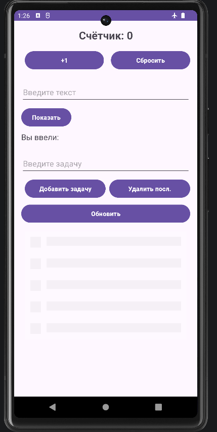
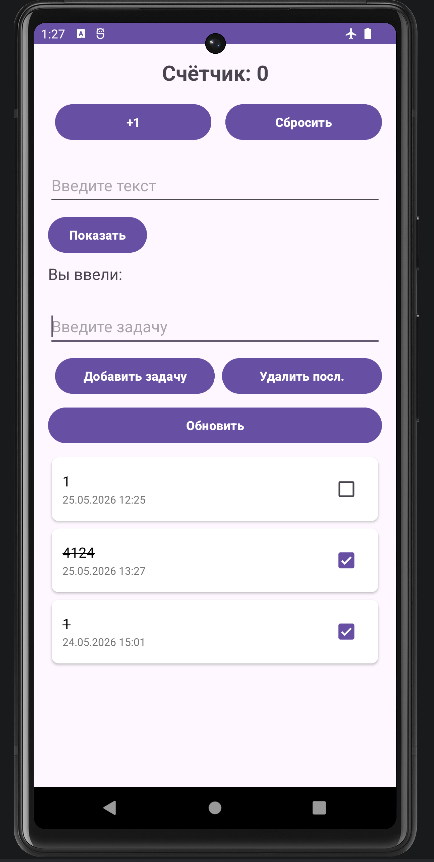
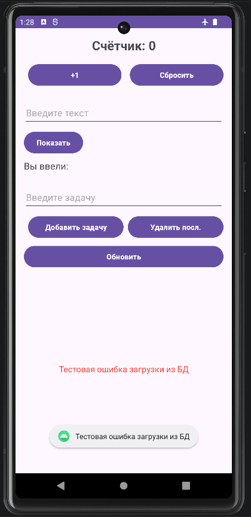

<div align="center">

**МИНИСТЕРСТВО НАУКИ И ВЫСШЕГО ОБРАЗОВАНИЯ РОССИЙСКОЙ ФЕДЕРАЦИИФЕДЕРАЛЬНОЕ ГОСУДАРСТВЕННОЕ БЮДЖЕТНОЕ ОБРАЗОВАТЕЛЬНОЕ УЧРЕЖДЕНИЕ ВЫСШЕГО ОБРАЗОВАНИЯ**  
**«САХАЛИНСКИЙ ГОСУДАРСТВЕННЫЙ УНИВЕРСИТЕТ»**

<br>
<br>

Институт естественных наук и техносферной безопасности  
Кафедра информатики  
Ощепков Алексей

<br>
<br>
<br>
<br>

Лабораторная работа №12  
«Выполнение длительных операций (симуляция загрузки) с использованием viewModelScope.»  
01.03.02 Прикладная математика и информатика  

<br>
<br>
<br>
<br>
<br>
<br>
<br>
<br>
<br>
<br>
<br>
<br>
<br>

<div align="right">
Научный руководитель<br>
Соболев Евгений Игоревич
</div>

<br>
<br>
<br>

г. Южно-Сахалинск  
2026 г.

</div>

---

# Л/р №12

## Выполнение длительных операций (симуляция загрузки) с использованием viewModelScope.

**Цель работы:** Научиться выполнять длительные операции в фоновом потоке с использованием корутин и viewModelScope, управлять состоянием загрузки в UI, реализовать имитацию загрузки данных и обработку ошибок.

---

## 1. Листинг `UiState.kt`.

```kotlin
package com.example.todoapp

import com.example.todoapp.database.TaskEntity

sealed class TasksUiState {
    object Loading : TasksUiState()
    data class Success(val tasks: List<TaskEntity>) : TasksUiState()
    data class Error(val message: String) : TasksUiState()
}
```

---

## 2. Листинг `MainViewModel.kt`.

```kotlin
package com.example.todoapp

import android.content.Context
import android.widget.Toast
import androidx.lifecycle.ViewModel
import androidx.lifecycle.viewModelScope
import com.example.todoapp.data.repository.TaskRepository
import com.example.todoapp.database.TaskEntity
import kotlinx.coroutines.delay
import kotlinx.coroutines.flow.MutableStateFlow
import kotlinx.coroutines.flow.StateFlow
import kotlinx.coroutines.flow.asStateFlow
import kotlinx.coroutines.launch

class MainViewModel(
    private val repository: TaskRepository,
    private val context: Context
) : ViewModel() {
    
    private val _uiState = MutableStateFlow<TasksUiState>(TasksUiState.Loading)
    val uiState: StateFlow<TasksUiState> = _uiState.asStateFlow()

    init {
        loadTasks()
    }
    
    fun loadTasks() {
        viewModelScope.launch {
            _uiState.value = TasksUiState.Loading
            try {
                delay(2000) // симуляция загрузки (2 сек)
                val tasks = repository.getTasksOnce()
                _uiState.value = TasksUiState.Success(tasks)
            } catch (e: Exception) {
                _uiState.value = TasksUiState.Error(e.message ?: "Ошибка загрузки")
                showError("Не удалось загрузить задачи")
            }
        }
    }
    
    fun addTask(title: String) {
        viewModelScope.launch {
            repository.addTask(title).onFailure { showError("Не удалось добавить задачу") }
            loadTasks() // перезагруж список для обновления UI
        }
    }

    fun deleteTask(task: TaskEntity) {
        viewModelScope.launch {
            repository.deleteTask(task).onFailure { showError("Не удалось удалить задачу") }
            loadTasks()
        }
    }

    fun toggleTaskCompletion(task: TaskEntity, isCompleted: Boolean) {
        viewModelScope.launch {
            repository.toggleTaskCompletion(task, isCompleted)
                .onFailure { showError("Не удалось обновить задачу") }
            loadTasks()
        }
    }

    fun deleteAllTasks() {
        viewModelScope.launch {
            repository.deleteAllTasks().onFailure { showError("Не удалось очистить список") }
            loadTasks()
        }
    }

    fun updateTaskTitle(taskId: Long, newTitle: String) {
        viewModelScope.launch {
            repository.updateTaskTitle(taskId, newTitle)
                .onFailure { showError("Не удалось обновить название") }
            loadTasks()
        }
    }

    fun deleteTaskById(taskId: Long) {
        viewModelScope.launch {
            repository.deleteTaskById(taskId).onFailure { showError("Не удалось удалить задачу") }
            loadTasks()
        }
    }

    fun restoreTask(task: TaskEntity) {
        viewModelScope.launch {
            repository.restoreTask(task).onFailure { showError("Не удалось восстановить задачу") }
            loadTasks()
        }
    }
    
    fun refresh() = loadTasks()

    private fun showError(message: String) {
        Toast.makeText(context, message, Toast.LENGTH_SHORT).show()
    }
}
```

---

## 3. Листинг `TaskRepository.kt`.

```kotlin
package com.example.todoapp.data.repository

import com.example.todoapp.database.TaskEntity
import kotlinx.coroutines.flow.Flow

interface TaskRepository {
    fun getSortedTasks(): Flow<List<TaskEntity>>

    suspend fun addTask(title: String): Result<Unit>
    suspend fun deleteTask(task: TaskEntity): Result<Unit>
    suspend fun updateTask(task: TaskEntity): Result<Unit>
    suspend fun toggleTaskCompletion(task: TaskEntity, isCompleted: Boolean): Result<Unit>
    suspend fun deleteAllTasks(): Result<Unit>

    // Методы для DetailActivity и Snackbar
    suspend fun updateTaskTitle(taskId: Long, newTitle: String): Result<Unit>
    suspend fun deleteTaskById(taskId: Long): Result<Unit>
    suspend fun restoreTask(task: TaskEntity): Result<Unit>

    // ЛР12
    suspend fun getTasksOnce(): List<TaskEntity>
}
```

---

## 4. Листинг `TaskRepositoryImpl.kt`.

```kotlin
package com.example.todoapp.data.repository

import com.example.todoapp.database.TaskDao
import com.example.todoapp.database.TaskEntity
import kotlinx.coroutines.flow.Flow
import kotlinx.coroutines.flow.first  

class TaskRepositoryImpl(
    private val taskDao: TaskDao
) : TaskRepository {

    override fun getSortedTasks(): Flow<List<TaskEntity>> = taskDao.getSortedTasks()

    override suspend fun addTask(title: String): Result<Unit> = try {
        // тест инд. 3 (обработка ошибок)
        //throw RuntimeException("Тестовая ошибка записи в Room")
        taskDao.insertTask(TaskEntity(title = title))
        Result.success(Unit)
    } catch (e: Exception) {
        Result.failure(e)
    }

    override suspend fun deleteTask(task: TaskEntity): Result<Unit> = try {
        taskDao.deleteTask(task)
        Result.success(Unit)
    } catch (e: Exception) {
        Result.failure(e)
    }

    override suspend fun updateTask(task: TaskEntity): Result<Unit> = try {
        taskDao.updateTask(task)
        Result.success(Unit)
    } catch (e: Exception) {
        Result.failure(e)
    }

    override suspend fun toggleTaskCompletion(task: TaskEntity, isCompleted: Boolean): Result<Unit> = try {
        taskDao.updateTask(task.copy(isCompleted = isCompleted))
        Result.success(Unit)
    } catch (e: Exception) {
        Result.failure(e)
    }

    override suspend fun deleteAllTasks(): Result<Unit> = try {
        taskDao.deleteAll()
        Result.success(Unit)
    } catch (e: Exception) {
        Result.failure(e)
    }
    
    override suspend fun updateTaskTitle(taskId: Long, newTitle: String): Result<Unit> = try {
        val task = taskDao.getTaskById(taskId) ?: return Result.success(Unit)
        taskDao.updateTask(task.copy(title = newTitle))
        Result.success(Unit)
    } catch (e: Exception) {
        Result.failure(e)
    }

    override suspend fun deleteTaskById(taskId: Long): Result<Unit> = try {
        val task = taskDao.getTaskById(taskId) ?: return Result.success(Unit)
        taskDao.deleteTask(task)
        Result.success(Unit)
    } catch (e: Exception) {
        Result.failure(e)
    }

    override suspend fun restoreTask(task: TaskEntity): Result<Unit> = try {
        taskDao.insertTask(task)
        Result.success(Unit)
    } catch (e: Exception) {
        Result.failure(e)
    }

    // однократное получение списка задач
    override suspend fun getTasksOnce(): List<TaskEntity> = try {
        taskDao.getSortedTasks().first() // first() возьмёт первое значение из Flow
    } catch (e: Exception) {
        emptyList() // при ошибке возвращаем пустой список
    }
}
```

---

## 5. Листинг `activity_main.xml`.

```xml
<?xml version="1.0" encoding="utf-8"?>
<LinearLayout
    xmlns:android="http://schemas.android.com/apk/res/android"
    xmlns:app="http://schemas.android.com/apk/res-auto"
    android:id="@+id/main"
    android:layout_width="match_parent"
    android:layout_height="match_parent"
    android:orientation="vertical"
    android:padding="16dp">

    <!-- счётчик нажатий -->
    <TextView
        android:id="@+id/textCounter"
        android:layout_width="match_parent"
        android:layout_height="wrap_content"
        android:text="@string/counter_text"
        android:textSize="24sp"
        android:textStyle="bold"
        android:gravity="center"
        android:layout_marginBottom="16dp"/>

    <!-- Кнопки счётчика -->
    <LinearLayout
        android:layout_width="match_parent"
        android:layout_height="wrap_content"
        android:orientation="horizontal"
        android:layout_marginBottom="24dp"
        style="?android:attr/buttonBarStyle">

        <Button
            android:id="@+id/buttonIncrement"
            style="?android:attr/buttonBarButtonStyle"
            android:layout_width="0dp"
            android:layout_height="wrap_content"
            android:layout_weight="1"
            android:text="@string/button_increment"
            android:layout_marginEnd="8dp"
            android:backgroundTint="@color/purple"
            android:textColor="@color/white"
            android:textStyle="bold"/>

        <Button
            android:id="@+id/buttonReset"
            style="?android:attr/buttonBarButtonStyle"
            android:layout_width="0dp"
            android:layout_height="wrap_content"
            android:layout_weight="1"
            android:text="@string/button_reset"
            android:backgroundTint="@color/purple"
            android:textColor="@color/white"
            android:textStyle="bold"/>
    </LinearLayout>

    <!-- Ввод текста -->
    <EditText
        android:id="@+id/editTextInput"
        android:layout_width="match_parent"
        android:layout_height="wrap_content"
        android:hint="@string/hint_input_text"
        android:inputType="text"
        android:autofillHints="text"
        android:layout_marginBottom="8dp"
        android:minHeight="48dp"/>

    <Button
        android:id="@+id/buttonShow"
        android:layout_width="wrap_content"
        android:layout_height="wrap_content"
        android:text="@string/button_show"
        android:layout_marginBottom="8dp"
        android:backgroundTint="@color/purple"
        android:textColor="@color/white"
        android:textStyle="bold"
        android:minWidth="48dp"
        android:minHeight="48dp"/>

    <TextView
        android:id="@+id/textEntered"
        android:layout_width="wrap_content"
        android:layout_height="wrap_content"
        android:text="@string/label_entered"
        android:textSize="18sp"
        android:layout_marginBottom="24dp"/>

    <!-- Ввод задачи -->
    <EditText
        android:id="@+id/editTextTask"
        android:layout_width="match_parent"
        android:layout_height="wrap_content"
        android:hint="@string/hint_input_task"
        android:inputType="text"
        android:autofillHints="text"
        android:layout_marginBottom="8dp"
        android:minHeight="48dp"/>

    <!-- Кнопки списка -->
    <LinearLayout
        android:layout_width="match_parent"
        android:layout_height="wrap_content"
        android:orientation="horizontal"
        android:layout_marginBottom="8dp"
        style="?android:attr/buttonBarStyle">

        <Button
            android:id="@+id/buttonAddTask"
            style="?android:attr/buttonBarButtonStyle"
            android:layout_width="0dp"
            android:layout_height="wrap_content"
            android:layout_weight="1"
            android:text="@string/button_add_task"
            android:layout_marginEnd="4dp"
            android:backgroundTint="@color/purple"
            android:textColor="@color/white"
            android:textStyle="bold"/>

        <Button
            android:id="@+id/buttonRemoveLast"
            style="?android:attr/buttonBarButtonStyle"
            android:layout_width="0dp"
            android:layout_height="wrap_content"
            android:layout_weight="1"
            android:text="@string/button_remove_last"
            android:layout_marginStart="4dp"
            android:backgroundTint="@color/purple"
            android:textColor="@color/white"
            android:textStyle="bold"/>
    </LinearLayout>

    <!-- Кнопка Обновить -->
    <Button
        android:id="@+id/buttonRefresh"
        android:layout_width="match_parent"
        android:layout_height="wrap_content"
        android:text="@string/button_refresh"
        android:layout_marginBottom="8dp"
        android:backgroundTint="@color/purple"
        android:textColor="@color/white"
        android:textStyle="bold"/>

    <!-- Контейнер для RecyclerView + Shimmer Skeleton + ошибка -->
    <FrameLayout
        android:layout_width="match_parent"
        android:layout_height="0dp"
        android:layout_weight="1">

        <!-- RecyclerView (список задач) -->
        <androidx.recyclerview.widget.RecyclerView
            android:id="@+id/recyclerViewTasks"
            android:layout_width="match_parent"
            android:layout_height="match_parent"
            android:clipToPadding="false"
            android:paddingBottom="8dp"
            android:visibility="gone" />

        <!-- Shimmer-скелетон (Идз №4) -->
        <com.facebook.shimmer.ShimmerFrameLayout
            android:id="@+id/shimmerContainer"
            android:layout_width="match_parent"
            android:layout_height="match_parent"
            android:visibility="gone"
            app:shimmer_duration="1200"
            app:shimmer_repeat_mode="reverse"
            app:shimmer_direction="left_to_right">

            <include layout="@layout/content_skeleton"/>

        </com.facebook.shimmer.ShimmerFrameLayout>

        <!-- TextView для ошибки -->
        <TextView
            android:id="@+id/textError"
            android:layout_width="wrap_content"
            android:layout_height="wrap_content"
            android:layout_gravity="center"
            android:text="@string/error_loading_data"
            android:textColor="#F44336"
            android:visibility="gone"
            android:gravity="center"
            android:padding="16dp"
            android:textSize="16sp" />

    </FrameLayout>

</LinearLayout>
```

---

## 6. Листинг `MainActivity.kt`.

```kotlin
package com.example.todoapp

import android.content.Intent
import android.os.Bundle
import android.view.View
import android.widget.Button
import android.widget.EditText
import android.widget.TextView
import android.widget.Toast
import androidx.activity.result.contract.ActivityResultContracts
import androidx.activity.viewModels
import androidx.appcompat.app.AppCompatActivity
import androidx.lifecycle.Lifecycle
import androidx.lifecycle.lifecycleScope
import androidx.lifecycle.repeatOnLifecycle
import androidx.recyclerview.widget.ItemTouchHelper
import androidx.recyclerview.widget.LinearLayoutManager
import androidx.recyclerview.widget.RecyclerView
import com.example.todoapp.database.AppDatabase
import com.example.todoapp.database.TaskEntity
import com.example.todoapp.data.repository.TaskRepositoryImpl
import com.facebook.shimmer.ShimmerFrameLayout
import com.google.android.material.snackbar.Snackbar
import kotlinx.coroutines.launch

class MainActivity : AppCompatActivity() {

    private val database by lazy { AppDatabase.getInstance(this) }
    private val repository by lazy { TaskRepositoryImpl(database.taskDao()) }
    
    private val viewModel: MainViewModel by viewModels {
        MainViewModelFactory(repository, applicationContext)
    }

    private lateinit var adapter: TaskAdapter
    private lateinit var recyclerView: RecyclerView
    private lateinit var shimmerContainer: ShimmerFrameLayout
    private lateinit var textError: TextView
    private lateinit var buttonRefresh: Button

    private var counter = 0
    private var lastDeletedTask: TaskEntity? = null

    override fun onCreate(savedInstanceState: Bundle?) {
        super.onCreate(savedInstanceState)
        setContentView(R.layout.activity_main)
        
        shimmerContainer = findViewById(R.id.shimmerContainer)
        textError = findViewById(R.id.textError)
        buttonRefresh = findViewById(R.id.buttonRefresh)
        recyclerView = findViewById(R.id.recyclerViewTasks)
        recyclerView.layoutManager = LinearLayoutManager(this)
        
        val textCounter = findViewById<TextView>(R.id.textCounter)
        val buttonIncrement = findViewById<Button>(R.id.buttonIncrement)
        val buttonReset = findViewById<Button>(R.id.buttonReset)

        if (savedInstanceState != null) counter = savedInstanceState.getInt("counter", 0)
        updateCounterDisplay(textCounter)

        buttonIncrement.setOnClickListener { counter++; updateCounterDisplay(textCounter) }
        buttonReset.setOnClickListener {
            counter = 0
            updateCounterDisplay(textCounter)
            Toast.makeText(this, R.string.toast_counter_reset, Toast.LENGTH_SHORT).show()
        }
        
        val editTextInput = findViewById<EditText>(R.id.editTextInput)
        val buttonShow = findViewById<Button>(R.id.buttonShow)
        val textEntered = findViewById<TextView>(R.id.textEntered)

        buttonShow.setOnClickListener {
            val input = editTextInput.text.toString().trim()
            textEntered.text = if (input.isNotBlank())
                getString(R.string.label_entered_with_text, input)
            else
                getString(R.string.label_entered)
        }
        
        val editTextTask = findViewById<EditText>(R.id.editTextTask)
        val buttonAddTask = findViewById<Button>(R.id.buttonAddTask)
        val buttonRemoveLast = findViewById<Button>(R.id.buttonRemoveLast)
        
        adapter = TaskAdapter(
            tasks = emptyList(),
            onItemClick = { task -> openTaskDetail(task) },
            onItemLongClick = { task -> viewModel.deleteTask(task) },
            onCheckChange = { task, isChecked -> viewModel.toggleTaskCompletion(task, isChecked) }
        )
        recyclerView.adapter = adapter
        
        lifecycleScope.launch {
            repeatOnLifecycle(Lifecycle.State.STARTED) {
                viewModel.uiState.collect { state ->
                    when (state) {
                        is TasksUiState.Loading -> {
                            recyclerView.visibility = View.GONE
                            shimmerContainer.visibility = View.VISIBLE
                            shimmerContainer.startShimmer() 
                            textError.visibility = View.GONE
                        }
                        is TasksUiState.Success -> {
                            recyclerView.visibility = View.VISIBLE
                            shimmerContainer.visibility = View.GONE
                            shimmerContainer.stopShimmer() 
                            textError.visibility = View.GONE
                            adapter.updateData(state.tasks)
                        }
                        is TasksUiState.Error -> {
                            recyclerView.visibility = View.GONE
                            shimmerContainer.visibility = View.GONE
                            shimmerContainer.stopShimmer()
                            textError.visibility = View.VISIBLE
                            textError.text = state.message
                            Toast.makeText(this@MainActivity, state.message, Toast.LENGTH_SHORT).show()
                        }
                    }
                }
            }
        }
        
        buttonRefresh.setOnClickListener {
            viewModel.refresh()
        }

        buttonAddTask.setOnClickListener {
            val task = editTextTask.text.toString().trim()
            if (task.isNotBlank()) {
                viewModel.addTask(task)
                editTextTask.text.clear()
            } else {
                Toast.makeText(this, R.string.toast_empty_task, Toast.LENGTH_SHORT).show()
            }
        }

        buttonRemoveLast.setOnClickListener {
            val current = adapter.tasks
            if (current.isNotEmpty()) {
                viewModel.deleteTask(current.last())
            } else {
                Toast.makeText(this, R.string.toast_list_empty, Toast.LENGTH_SHORT).show()
            }
        }

        setupSwipeToDelete()
    }

    override fun onSaveInstanceState(outState: Bundle) {
        super.onSaveInstanceState(outState)
        outState.putInt("counter", counter)
    }

    private fun updateCounterDisplay(tv: TextView) {
        tv.text = getString(R.string.counter_text, counter)
    }
    
    private fun setupSwipeToDelete() {
        val callback = object : ItemTouchHelper.SimpleCallback(0, ItemTouchHelper.LEFT or ItemTouchHelper.RIGHT) {
            override fun onMove(
                rv: RecyclerView,
                viewHolder: RecyclerView.ViewHolder,
                target: RecyclerView.ViewHolder
            ): Boolean = false

            override fun onSwiped(viewHolder: RecyclerView.ViewHolder, direction: Int) {
                val position = viewHolder.absoluteAdapterPosition
                if (position == RecyclerView.NO_POSITION) return

                lastDeletedTask = adapter.tasks.getOrNull(position)
                lastDeletedTask?.let { viewModel.deleteTask(it) }

                Snackbar.make(recyclerView, "Задача удалена", Snackbar.LENGTH_LONG)
                    .setAction("ОТМЕНА") {
                        lastDeletedTask?.let { viewModel.restoreTask(it) }
                    }.show()
            }
        }
        ItemTouchHelper(callback).attachToRecyclerView(recyclerView)
    }
    
    private val detailResultLauncher = registerForActivityResult(
        ActivityResultContracts.StartActivityForResult()
    ) { result ->
        if (result.resultCode == RESULT_OK) {
            val action = result.data?.getStringExtra("action_type")
            val taskId = result.data?.getLongExtra("task_id", -1L) ?: -1L
            when (action) {
                "updated" -> {
                    val newText = result.data?.getStringExtra("task_text")
                    if (taskId != -1L && newText != null) {
                        viewModel.updateTaskTitle(taskId, newText)
                    }
                }
                "deleted" -> if (taskId != -1L) {
                    viewModel.deleteTaskById(taskId)
                }
            }
        }
    }

    private fun openTaskDetail(task: TaskEntity) {
        val intent = Intent(this, DetailActivity::class.java).apply {
            putExtra("task_text", task.title)
            putExtra("task_id", task.id)
        }
        detailResultLauncher.launch(intent)
    }
}
```

---

## 7. Скриншоты приложения в состояниях загрузки, успеха и ошибки.

## `Состояние загрузки`.


## `Состояние успеха`.


## `Состояние ошибки`.

Искусственно создаю ошибку: 
```kotlin
override suspend fun getTasksOnce(): List<TaskEntity> {
    throw RuntimeException("Тестовая ошибка загрузки из БД")
}
```
Результат:



---

## 8. Ответы на контрольные вопросы.

**1. Почему длительные операции нельзя выполнять в главном потоке?**

***Ответ:*** Главный поток отвечает за отрисовку интерфейса и обработку пользовательских событий. Если его заблокировать интерфейс зависнет.

**2. Что такое `viewModelScope` и как он связан с жизненным циклом ViewModel?**

***Ответ:*** `viewModelScope` это встроенная область корутин, привязанная к жизненному циклу `ViewModel`. Все корутины, запущенные в этой области, автоматически отменяются при вызове `ViewModel.onCleared()`. Это предотвращает утечки памяти.

**3. Какие преимущества даёт использование sealed class для представления состояний UI?**

***Ответ:*** 

1. Читаемость: все возможные состояния экрана описаны в одном месте.
2. Расширяемость: легко добавить новое состояние.

**4. Как имитировать задержку в корутине?**

***Ответ:*** С помощью suspend-функции `delay(milliseconds)`, которая приостанавливает выполнение корутины на указанное время без блокировки потока.

```kotlin
viewModelScope.launch {
    delay(2000) // имитация 2-секундной загрузки
}
```

**5. Как обрабатывать ошибки при выполнении корутин?**

***Ответ:*** С помощью try-catch внутри корутины.

```kotlin
viewModelScope.launch {
    try {
        val data = repository.getTasksOnce()
        _uiState.value = TasksUiState.Success(data)
    } catch (e: Exception) {
        _uiState.value = TasksUiState.Error(e.message ?: "Неизвестная ошибка")
    }
}
```

---

## 9. Вывод по работе.

В ходе выполнения лабораторной работы №12:
1. Научился выполнять длительные операции в фоновом потоке с использованием корутин и viewModelScope.
2. Научился управлять состоянием UI через StateFlow и sealed class (Loading / Success / Error).
3. Научился имитировать задержку загрузки с помощью delay() и обрабатывать ошибки через try-catch.

Выполнил индивидуальное задание 4.