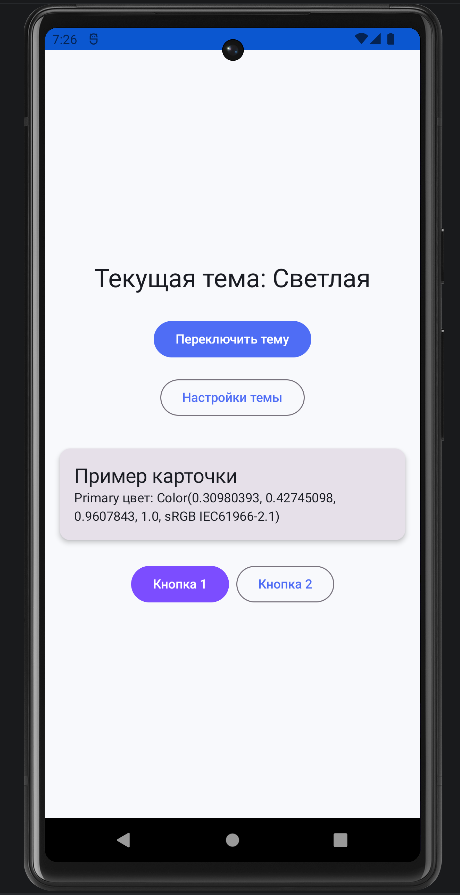
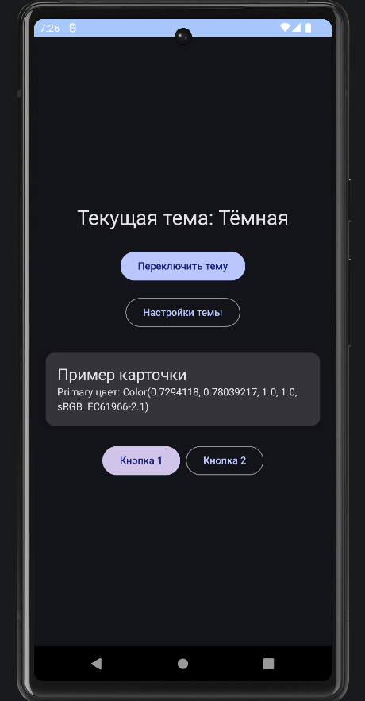

<div align="center">

**МИНИСТЕРСТВО НАУКИ И ВЫСШЕГО ОБРАЗОВАНИЯ РОССИЙСКОЙ ФЕДЕРАЦИИФЕДЕРАЛЬНОЕ ГОСУДАРСТВЕННОЕ БЮДЖЕТНОЕ ОБРАЗОВАТЕЛЬНОЕ УЧРЕЖДЕНИЕ ВЫСШЕГО ОБРАЗОВАНИЯ**  
**«САХАЛИНСКИЙ ГОСУДАРСТВЕННЫЙ УНИВЕРСИТЕТ»**

<br>
<br>

Институт естественных наук и техносферной безопасности  
Кафедра информатики  
Ощепков Алексей

<br>
<br>
<br>
<br>

Лабораторная работа №9  
«Сохранение настроек темы.»  
01.03.02 Прикладная математика и информатика  

<br>
<br>
<br>
<br>
<br>
<br>
<br>
<br>
<br>
<br>
<br>
<br>
<br>

<div align="right">
Научный руководитель<br>
Соболев Евгений Игоревич
</div>

<br>
<br>
<br>

г. Южно-Сахалинск  
2026 г.

</div>

---

# Л/р №9

## Сохранение настроек темы. Тёмная/светлая тема в Compose.

**Цель работы:** Изучить механизмы смены и сохранения темы приложения в Jetpack Compose, научиться использовать DataStore/SharedPreferences для хранения пользовательских настроек, реализовать переключение между тёмной и светлой темами.

---

## 1. Листинг `Color.kt`.

```kotlin
package com.example.themeswitcher.ui.theme

import androidx.compose.ui.graphics.Color
import androidx.compose.material3.*

// Светлая тема
val LightColors = lightColorScheme(
    primary = Color(0xFF4F6DF5),
    onPrimary = Color(0xFFFFFFFF),
    primaryContainer = Color(0xFFE0E7FF),
    onPrimaryContainer = Color(0xFF1A237E),
    secondary = Color(0xFF7C4DFF),
    onSecondary = Color(0xFFFFFFFF),
    secondaryContainer = Color(0xFFEDE7F6),
    onSecondaryContainer = Color(0xFF311B92),
    tertiary = Color(0xFF00BFA5),
    onTertiary = Color(0xFF00332C),
    tertiaryContainer = Color(0xFFA7FFEB),
    onTertiaryContainer = Color(0xFF004D40),
    background = Color(0xFFF8F9FC),
    onBackground = Color(0xFF1A1C23),
    surface = Color(0xFFFFFFFF),
    onSurface = Color(0xFF1A1C23),
)

// Тёмная тема
val DarkColors = darkColorScheme(
    primary = Color(0xFFBAC7FF),
    onPrimary = Color(0xFF1A237E),
    primaryContainer = Color(0xFF3547C7),
    onPrimaryContainer = Color(0xFFE0E7FF),
    secondary = Color(0xFFD1C4E9),
    onSecondary = Color(0xFF311B92),
    secondaryContainer = Color(0xFF5E35B1),
    onSecondaryContainer = Color(0xFFEDE7F6),
    tertiary = Color(0xFF66FFD9),
    onTertiary = Color(0xFF00332C),
    tertiaryContainer = Color(0xFF00897B),
    onTertiaryContainer = Color(0xFFA7FFEB),
    background = Color(0xFF12141A),
    onBackground = Color(0xFFE3E2E6),
    surface = Color(0xFF1E2028),
    onSurface = Color(0xFFE3E2E6),
)
```

---

## 2. Листинг `Theme.kt`.

```kotlin
package com.example.themeswitcher.ui.theme

import android.app.Activity
import android.os.Build
import androidx.compose.foundation.isSystemInDarkTheme
import androidx.compose.material3.*
import androidx.compose.runtime.*
import androidx.compose.runtime.SideEffect
import androidx.compose.ui.graphics.toArgb
import androidx.compose.ui.platform.LocalContext
import androidx.compose.ui.platform.LocalView
import androidx.core.view.WindowCompat
import androidx.lifecycle.viewmodel.compose.viewModel
import androidx.compose.animation.Crossfade
import androidx.compose.animation.core.LinearEasing
import androidx.compose.animation.core.tween

@Composable
fun ThemeSwitcherTheme(
    viewModel: ThemeViewModel = viewModel(),
    content: @Composable () -> Unit
) {
    val context = LocalContext.current
    val isDarkTheme by viewModel.isDarkTheme.collectAsState()

    val colorScheme = when {
        Build.VERSION.SDK_INT >= Build.VERSION_CODES.S -> {
            if (isDarkTheme) dynamicDarkColorScheme(context) else dynamicLightColorScheme(context)
        }
        isDarkTheme -> DarkColors
        else -> LightColors
    }

    val view = LocalView.current
    if (!view.isInEditMode) {
        SideEffect {
            val window = (view.context as Activity).window
            window.statusBarColor = colorScheme.primary.toArgb()
            WindowCompat.getInsetsController(window, view).isAppearanceLightStatusBars = !isDarkTheme
        }
    }

    // анимация
    Crossfade(
        targetState = isDarkTheme,
        animationSpec = tween(durationMillis = 400, easing = LinearEasing),
        label = "ThemeCrossfade"
    ) { dark ->
        MaterialTheme(
            colorScheme = if (dark) DarkColors else LightColors,
            typography = Typography(),
            content = content
        )
    }
}
```

---

## 3. Листинг `SettingsManager.kt`.

```kotlin
package com.example.themeswitcher.data

import android.content.Context
import androidx.datastore.preferences.core.booleanPreferencesKey
import androidx.datastore.preferences.core.edit
import androidx.datastore.preferences.preferencesDataStore
import kotlinx.coroutines.flow.Flow
import kotlinx.coroutines.flow.map

val Context.dataStore by preferencesDataStore(name = "settings")

class SettingsManager(private val context: Context) {

    companion object {
        val DARK_MODE_KEY = booleanPreferencesKey("dark_mode")
    }

    val isDarkMode: Flow<Boolean> = context.dataStore.data
        .map { preferences ->
            preferences[DARK_MODE_KEY] ?: false // по умолчанию светлая тема
        }

    suspend fun saveDarkMode(enabled: Boolean) {
        context.dataStore.edit { preferences ->
            preferences[DARK_MODE_KEY] = enabled
        }
    }
}
```

---

## 4. Листинг `ThemeViewModel.kt`.

```kotlin
package com.example.themeswitcher.ui.theme

import androidx.lifecycle.ViewModel
import androidx.lifecycle.viewModelScope
import com.example.themeswitcher.data.SettingsManager
import kotlinx.coroutines.flow.SharingStarted
import kotlinx.coroutines.flow.StateFlow
import kotlinx.coroutines.flow.stateIn
import kotlinx.coroutines.launch

class ThemeViewModel(
    private val settingsManager: SettingsManager
) : ViewModel() {

    val isDarkTheme: StateFlow<Boolean> = settingsManager.isDarkMode
        .stateIn(
            scope = viewModelScope,
            started = SharingStarted.WhileSubscribed(5000),
            initialValue = false
        )

    fun toggleTheme() {
        viewModelScope.launch {
            val currentValue = isDarkTheme.value
            settingsManager.saveDarkMode(!currentValue)
        }
    }
}
```

---

## 5. Листинг `MainActivity.kt`.

```kotlin
package com.example.themeswitcher

import android.os.Bundle
import androidx.activity.ComponentActivity
import androidx.activity.compose.setContent
import androidx.compose.foundation.layout.*
import androidx.compose.material.icons.Icons
import androidx.compose.material.icons.automirrored.filled.ArrowBack
import androidx.compose.material3.*
import androidx.compose.runtime.*
import androidx.compose.runtime.saveable.rememberSaveable
import androidx.compose.ui.Alignment
import androidx.compose.ui.Modifier
import androidx.compose.ui.unit.dp
import androidx.lifecycle.viewmodel.compose.viewModel
import com.example.themeswitcher.data.SettingsManager
import com.example.themeswitcher.ui.theme.ThemeSwitcherTheme
import com.example.themeswitcher.ui.theme.ThemeViewModel
import com.example.themeswitcher.ui.theme.ThemeViewModelFactory

class MainActivity : ComponentActivity() {
    override fun onCreate(savedInstanceState: Bundle?) {
        super.onCreate(savedInstanceState)

        val settingsManager = SettingsManager(this)

        setContent {
            ThemeSwitcherTheme(
                viewModel = viewModel(factory = ThemeViewModelFactory(settingsManager))
            ) {
                Surface(
                    modifier = Modifier.fillMaxSize(),
                    color = MaterialTheme.colorScheme.background
                ) {
                    AppNavigation(
                        viewModel = viewModel(factory = ThemeViewModelFactory(settingsManager))
                    )
                }
            }
        }
    }
}

@Composable
fun AppNavigation(viewModel: ThemeViewModel) {
    var isOnSettingsScreen by rememberSaveable { mutableStateOf(false) }

    if (isOnSettingsScreen) {
        SettingsScreen(
            viewModel = viewModel,
            onBackClick = { isOnSettingsScreen = false }
        )
    } else {
        ThemeScreen(
            viewModel = viewModel,
            onSettingsClick = { isOnSettingsScreen = true }
        )
    }
}

@Composable
fun ThemeScreen(
    viewModel: ThemeViewModel,
    onSettingsClick: () -> Unit
) {
    val isDarkTheme by viewModel.isDarkTheme.collectAsState()

    Column(
        modifier = Modifier
            .fillMaxSize()
            .padding(16.dp),
        horizontalAlignment = Alignment.CenterHorizontally,
        verticalArrangement = Arrangement.Center
    ) {
        Text(
            text = "Текущая тема: ${if (isDarkTheme) "Тёмная" else "Светлая"}",
            style = MaterialTheme.typography.headlineMedium
        )

        Spacer(modifier = Modifier.height(24.dp))

        Button(onClick = { viewModel.toggleTheme() }) {
            Text("Переключить тему")
        }

        Spacer(modifier = Modifier.height(16.dp))

        // Кнопка перехода в настройки
        OutlinedButton(onClick = onSettingsClick) {
            Text("Настройки темы")
        }

        Spacer(modifier = Modifier.height(32.dp))

        Card(
            modifier = Modifier.fillMaxWidth(),
            elevation = CardDefaults.cardElevation(defaultElevation = 4.dp)
        ) {
            Column(
                modifier = Modifier.padding(16.dp)
            ) {
                Text(
                    text = "Пример карточки",
                    style = MaterialTheme.typography.titleLarge
                )
                Text(
                    text = "Primary цвет: ${MaterialTheme.colorScheme.primary}",
                    style = MaterialTheme.typography.bodyMedium
                )
            }
        }

        Spacer(modifier = Modifier.height(24.dp))

        Row(
            horizontalArrangement = Arrangement.spacedBy(8.dp)
        ) {
            Button(
                onClick = { /* Действие 1 */ },
                colors = ButtonDefaults.buttonColors(
                    containerColor = MaterialTheme.colorScheme.secondary
                )
            ) {
                Text("Кнопка 1")
            }

            OutlinedButton(onClick = { /* Действие 2 */ }) {
                Text("Кнопка 2")
            }
        }
    }
}

@Composable
fun SettingsScreen(
    viewModel: ThemeViewModel,
    onBackClick: () -> Unit
) {
    val isDarkTheme by viewModel.isDarkTheme.collectAsState()

    Column(
        modifier = Modifier
            .fillMaxSize()
            .padding(16.dp)
    ) {
        // Шапка с кнопкой назад
        Row(
            modifier = Modifier.fillMaxWidth(),
            verticalAlignment = Alignment.CenterVertically
        ) {
            IconButton(onClick = onBackClick) {
                Icon(
                    imageVector = Icons.AutoMirrored.Filled.ArrowBack,
                    contentDescription = "Назад"
                )
            }
            Text(
                text = "Настройки",
                style = MaterialTheme.typography.headlineLarge,
                modifier = Modifier.padding(start = 8.dp)
            )
        }

        Spacer(modifier = Modifier.height(24.dp))

        Card(
            modifier = Modifier.fillMaxWidth(),
            colors = CardDefaults.cardColors(
                containerColor = MaterialTheme.colorScheme.surfaceVariant
            )
        ) {
            Row(
                modifier = Modifier
                    .fillMaxWidth()
                    .padding(16.dp),
                horizontalArrangement = Arrangement.SpaceBetween,
                verticalAlignment = Alignment.CenterVertically
            ) {
                Text(
                    text = "Тёмная тема",
                    style = MaterialTheme.typography.bodyLarge
                )
                Switch(
                    checked = isDarkTheme,
                    onCheckedChange = { viewModel.toggleTheme() }
                )
            }
        }

        Spacer(modifier = Modifier.height(16.dp))
    }
}
```

---

## 6. Скриншоты приложения в светлой и тёмной темах.

## `Светлая тема`.


## `Тёмная тема`.


---

## 7. Ответы на контрольные вопросы.

**1. Как в Compose определить, какая тема активна в данный момент (тёмная/светлая)?**

***Ответ:*** С помощью функции `isSystemInDarkTheme()`, которая возвращает **true**, если на устройстве включена тёмная тема.

**2. Что такое `MaterialTheme.colorScheme` и какие основные цвета он содержит?**

***Ответ:*** Это объект палитры текущей темы. Содержит: **primary**, **secondary**, **tertiary**, **background**, **surface**, **error**.

**3. Как сохранить выбор темы пользователя между сессиями работы приложения?**

***Ответ:*** Через `DataStore Preferences`. Выбор записывается в корутине `context.dataStore`.edit.

**4. В чём разница между `isSystemInDarkTheme()` и сохранённым пользовательским выбором?**

***Ответ:*** `isSystemInDarkTheme()` читает глобальную настройку ОС. Сохранённый выбор это предпочтение пользователя, которое имеет приоритет над системой и не сбрасывается при перезапуске приложения.

**5. Что такое динамические цвета (dynamic color) и на каких версиях Android они доступны?**

***Ответ:*** Динамические цвета `dynamicLightColorScheme`, `dynamicDarkColorScheme` автоматически генерируются из обоев устройства. Доступны начиная с Android 12 (API 31).

---

## 8. Вывод по работе.

В ходе выполнения лабораторной работы №9:
1. Изучил механизмы сохранения тёмной и светлой темы в `Jetpack Compose`.
2. Освоил создание кастомных `ColorScheme`.
3. Научился применять `DataStore Preferences` для надёжного хранения настроек.

Выполнил индивидуальное задание 4.