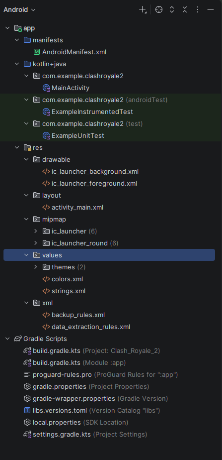
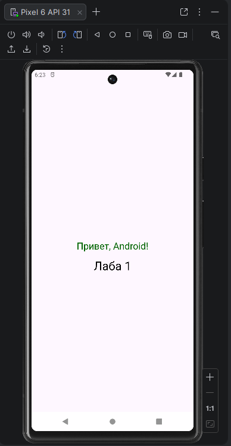

<div align="center">

**МИНИСТЕРСТВО НАУКИ И ВЫСШЕГО ОБРАЗОВАНИЯ РОССИЙСКОЙ ФЕДЕРАЦИИФЕДЕРАЛЬНОЕ ГОСУДАРСТВЕННОЕ БЮДЖЕТНОЕ ОБРАЗОВАТЕЛЬНОЕ УЧРЕЖДЕНИЕ ВЫСШЕГО ОБРАЗОВАНИЯ**  
**«САХАЛИНСКИЙ ГОСУДАРСТВЕННЫЙ УНИВЕРСИТЕТ»**

<br>
<br>

Институт естественных наук и техносферной безопасности  
Кафедра информатики  
Ощепков Алексей

<br>
<br>
<br>
<br>

Лабораторная работа №1  
«Создание первого проекта в Android Studio.»  
01.03.02 Прикладная математика и информатика  

<br>
<br>
<br>
<br>
<br>
<br>
<br>
<br>
<br>
<br>
<br>
<br>
<br>

<div align="right">
Научный руководитель<br>
Соболев Евгений Игоревич
</div>

<br>
<br>
<br>

г. Южно-Сахалинск  
2026 г.

</div>

---

# Л/р №1

## Создание первого проекта в Android Studio. Запуск на эмуляторе. Обзор интерфейса.

**Цель работы:** Ознакомиться со средой разработки Android Studio, создать и запустить простое приложение, изучить структуру проекта и базовые элементы интерфейса.

---

## 1. Скриншот созданного проекта в Android Studio (структура проекта).



---

## 2. Скриншот работающего приложения на эмуляторе (после модификации).



---

## 3. Индивидуальное задание: Листинг файла `activity_main.xml`.

```kotlin
<?xml version="1.0" encoding="utf-8"?>
<androidx.constraintlayout.widget.ConstraintLayout xmlns:android="http://schemas.android.com/apk/res/android"
    xmlns:app="http://schemas.android.com/apk/res-auto"
    xmlns:tools="http://schemas.android.com/tools"
    android:id="@+id/main"
    android:layout_width="match_parent"
    android:layout_height="match_parent"
    tools:context=".MainActivity">

    <TextView
        android:layout_width="wrap_content"
        android:layout_height="wrap_content"
        android:text="@string/greeting"
        android:textColor="#006400"
        android:textSize="24sp"
        app:layout_constraintBottom_toBottomOf="parent"
        app:layout_constraintEnd_toEndOf="parent"
        app:layout_constraintStart_toStartOf="parent"
        app:layout_constraintTop_toTopOf="parent" />


    <TextView
        android:layout_width="wrap_content"
        android:layout_height="wrap_content"
        android:text="@string/sub_text"
        android:textSize="30sp"
        android:textColor="#000000"
        android:layout_marginTop="100dp"
        app:layout_constraintBottom_toBottomOf="parent"
        app:layout_constraintEnd_toEndOf="parent"
        app:layout_constraintStart_toStartOf="parent"
        app:layout_constraintTop_toTopOf="parent" />


</androidx.constraintlayout.widget.ConstraintLayout>
```

---

## 4. Ответы на контрольные вопросы.

**1. Какие основные компоненты входят в структуру Android-проекта?**

***Ответ:*** Основные компоненты проекта:

`AndroidManifest.xml` — файл, описывающий приложение.

`java/` — исходный код (активности, классы).

`res/` — ресурсы (изображения, стили).

`Gradle Scripts` — файлы сборки.

**2. Для чего нужен файл `AndroidManifest.xml`?**

***Ответ:*** Файл `AndroidManifest.xml` описывает версии, компоненты приложения (активности, иконка, имя), запрашивает разрешения.

**3. Чем отличается `minSdkVersion` от `targetSdkVersion`?**

***Ответ:*** `minSdkVersion` — минимальная версия Android, на которой приложение будет работать. `targetSdkVersion` — версия, под которую оптимизировано приложение.

**4. Что такое AVD и для чего он используется?**

***Ответ:*** AVD (Android Virtual Device) - виртуальное устройство для тестирования приложений на разных версиях Android без физического устройства.

**5. Как изменить текст приложения без изменения кода активности?**

***Ответ:*** Через файл `res/values/strings.xml`: добавить строку `<string name="abc">Текст</string>` и использовать `@string/abc` в `res/layout/activity_main.xml`.

---

## 5. Вывод по работе.

В ходе лабораторной работы ознакомился с Android Studio: создал проект, изучил структуру, настроил эмулятор и запустил приложение. Научился модифицировать интерфейс через `strings.xml`.