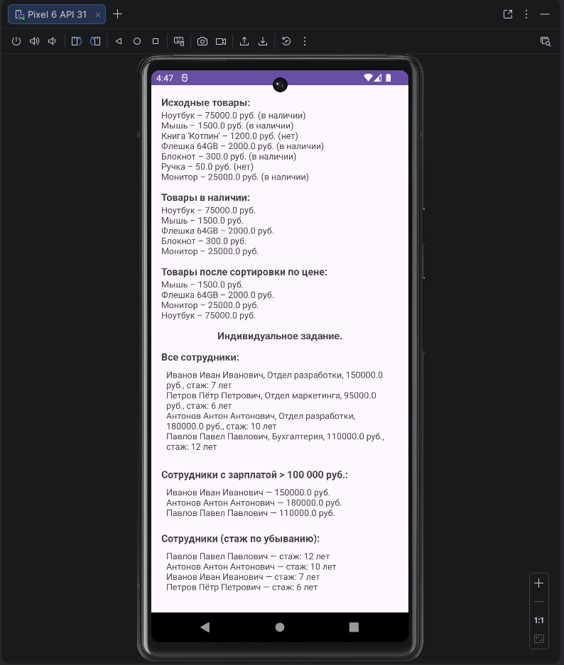

<div align="center">

**МИНИСТЕРСТВО НАУКИ И ВЫСШЕГО ОБРАЗОВАНИЯ РОССИЙСКОЙ ФЕДЕРАЦИИФЕДЕРАЛЬНОЕ ГОСУДАРСТВЕННОЕ БЮДЖЕТНОЕ ОБРАЗОВАТЕЛЬНОЕ УЧРЕЖДЕНИЕ ВЫСШЕГО ОБРАЗОВАНИЯ**  
**«САХАЛИНСКИЙ ГОСУДАРСТВЕННЫЙ УНИВЕРСИТЕТ»**

<br>
<br>

Институт естественных наук и техносферной безопасности  
Кафедра информатики  
Ощепков Алексей

<br>
<br>
<br>
<br>

Лабораторная работа №3  
«Реализация списка объектов с фильтрацией.»  
01.03.02 Прикладная математика и информатика  

<br>
<br>
<br>
<br>
<br>
<br>
<br>
<br>
<br>
<br>
<br>
<br>
<br>

<div align="right">
Научный руководитель<br>
Соболев Евгений Игоревич
</div>

<br>
<br>
<br>

г. Южно-Сахалинск  
2026 г.

</div>

---

# Л/р №3

## Реализация списка объектов с фильтрацией с использованием .map, .filter, .sortedBy

**Цель работы:** Изучить функциональные методы обработки коллекций в Kotlin (`filter`, `map`, `sortedBy`) на примере списка объектов и вывести результаты в интерфейс Android-приложения.

---

## 1. Листинг классов `Product`, `Employee` и `MainActivity`.

Класс `Product`.

```kotlin
package models

data class Product(
    val name: String,
    val category: String,
    val price: Double,
    val inStock: Boolean
)
```

Класс `Employee` (индивидуальное задание).

```kotlin
package models

data class Employee(
    val name: String,
    val department: String,
    val salary: Double,
    val experience: Int
)
```

Класс `MainActivity`.

```kotlin
package com.example.myapplication

import androidx.appcompat.app.AppCompatActivity
import android.os.Bundle
import android.widget.TextView
import models.Product
import models.Employee

class MainActivity : AppCompatActivity() {
    override fun onCreate(savedInstanceState: Bundle?) {
        super.onCreate(savedInstanceState)
        setContentView(R.layout.activity_main)

        val products = getProducts()

        // Исходный список
        val originalText = products.joinToString("\n") {
            "${it.name} – ${it.price} руб. (${if (it.inStock) "в наличии" else "нет"})"
        }
        findViewById<TextView>(R.id.textOriginal).text = originalText

        // Только в наличии
        val inStockProducts = products.filter { it.inStock }
        val inStockText = inStockProducts.joinToString("\n") { "${it.name} – ${it.price} руб." }
        findViewById<TextView>(R.id.textInStock).text = inStockText

        // Электроника в наличии, отсортированная по цене
        val electronicsSorted = products
            .filter { it.category == "Электроника" && it.inStock }
            .sortedBy { it.price }
            .map { "${it.name} – ${it.price} руб." }
        findViewById<TextView>(R.id.textSorted).text = electronicsSorted.joinToString("\n")


        // Список сотрудников -----------
        val employees = getEmployees()

        // Все сотрудники
        val originalEmployeesText = employees.joinToString("\n") { employee ->
            "${employee.name}, ${employee.department}, ${employee.salary} руб., стаж: ${employee.experience} лет"
        }
        findViewById<TextView>(R.id.textOriginalEmployees).text = originalEmployeesText

        // Сотрудники с зарплатой > 100000
        val highSalaryEmployees = employees.filter { it.salary > 100000.0 }

        val highSalaryText = if (highSalaryEmployees.isEmpty()) {"Нет сотрудников с зарплатой > 100 000 руб."}
        else {
            highSalaryEmployees.joinToString("\n") { emp -> "${emp.name} — ${emp.salary} руб."}
        }
        findViewById<TextView>(R.id.textHighSalary).text = highSalaryText

        // Сотрудники по стажу
        val sortedByExperience = employees
            .sortedByDescending { it.experience }
            .map { "${it.name} — стаж: ${it.experience} лет" }

        findViewById<TextView>(R.id.textSortedEmployees).text = sortedByExperience.joinToString("\n")
    }
    private fun getProducts(): List<Product> {
        return listOf(
            Product("Ноутбук", "Электроника", 75000.0, true),
            Product("Мышь", "Электроника", 1500.0, true),
            Product("Книга 'Котлин'", "Книги", 1200.0, false),
            Product("Флешка 64GB", "Электроника", 2000.0, true),
            Product("Блокнот", "Канцелярия", 300.0, true),
            Product("Ручка", "Канцелярия", 50.0, false),
            Product("Монитор", "Электроника", 25000.0, true)
        )
    }

    private fun getEmployees(): List<Employee> {
        return listOf(
            Employee("Иванов Иван Иванович", "Отдел разработки", 150000.0, 7),
            Employee("Петров Пётр Петрович", "Отдел маркетинга", 95000.0, 6),
            Employee("Антонов Антон Антонович", "Отдел разработки", 180000.0, 10),
            Employee("Павлов Павел Павлович", "Бухгалтерия", 110000.0, 12),
        )
    }
}
```

---

## 2. Скриншот работающего приложения.

### Результат юнит-теста `StringUtilsTest`:


---

## 3. Ответы на контрольные вопросы.

**1. Что возвращает функция `filter` – новый список или изменяет существующий?**

***Ответ:*** Функция `filter` возвращает список, содержащий только элементы, удовлетворяющие условию.

**2. В чём разница между sortedBy и sortedByDescending?**

***Ответ:*** `sortedBy` — сортировка по возрастанию, `sortedByDescending` — по убыванию.

**3. Как можно объединить несколько условий в filter?**

***Ответ:*** Использовать логические операторы: **&& (и)**, **|| (или)**, **! (не)**.

**4. Для чего используется функция map? Приведите пример.**

***Ответ:*** Функция `map` предназначена для преобразования каждого элемента коллекции по заданному правилу. 

```kotlin
// Пример 1: Числа в их квадраты
val numbers = listOf(1, 2, 3, 4, 5)
val squares = numbers.map { it * it }  
// Результат: 1, 4, 9, 16, 25
```

**5. Что такое joinToString и как она работает?**

***Ответ:*** Функция `joinToString` преобразует коллекцию элементов в одну строку, объединяя их с указанным разделителем.

---

## 5. Вывод по работе.

В ходе выполнения лабораторной работы №3 были изучены функциональные методы Kotlin:

`filter` — фильтрация элементов по условию

`map` — преобразование элементов

`sortedBy` и `sortedByDescending` — сортировка

`joinToString` — объединение в строку

Выполнено индивидуальное задание (Вариант 2: Сотрудники).