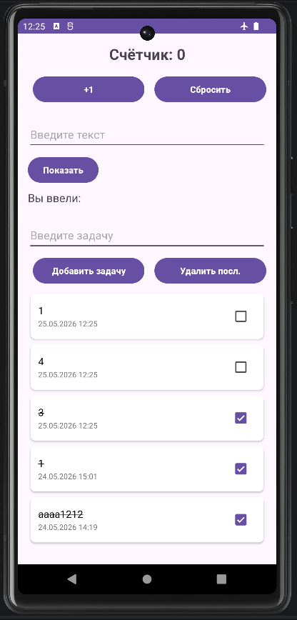
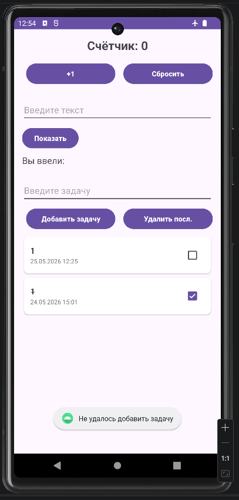

<div align="center">

**МИНИСТЕРСТВО НАУКИ И ВЫСШЕГО ОБРАЗОВАНИЯ РОССИЙСКОЙ ФЕДЕРАЦИИФЕДЕРАЛЬНОЕ ГОСУДАРСТВЕННОЕ БЮДЖЕТНОЕ ОБРАЗОВАТЕЛЬНОЕ УЧРЕЖДЕНИЕ ВЫСШЕГО ОБРАЗОВАНИЯ**  
**«САХАЛИНСКИЙ ГОСУДАРСТВЕННЫЙ УНИВЕРСИТЕТ»**

<br>
<br>

Институт естественных наук и техносферной безопасности  
Кафедра информатики  
Ощепков Алексей

<br>
<br>
<br>
<br>

Лабораторная работа №11  
«Добавление слоя Repository между ViewModel и Room.»  
01.03.02 Прикладная математика и информатика  

<br>
<br>
<br>
<br>
<br>
<br>
<br>
<br>
<br>
<br>
<br>
<br>
<br>

<div align="right">
Научный руководитель<br>
Соболев Евгений Игоревич
</div>

<br>
<br>
<br>

г. Южно-Сахалинск  
2026 г.

</div>

---

# Л/р №11

## Рефакторинг: добавление слоя Repository между ViewModel и Room.

**Цель работы:** Изучить архитектурный паттерн Repository, научиться выделять слой доступа к данным, отделяя его от бизнес-логики, выполнить рефакторинг существующего приложения для использования репозитория.

---

## 1. Листинг `TaskRepository.kt`.

```kotlin
package com.example.todoapp.data.repository

import com.example.todoapp.database.TaskEntity
import kotlinx.coroutines.flow.Flow

interface TaskRepository {
    fun getSortedTasks(): Flow<List<TaskEntity>>

    suspend fun addTask(title: String): Result<Unit>
    suspend fun deleteTask(task: TaskEntity): Result<Unit>
    suspend fun updateTask(task: TaskEntity): Result<Unit>
    suspend fun toggleTaskCompletion(task: TaskEntity, isCompleted: Boolean): Result<Unit>
    suspend fun deleteAllTasks(): Result<Unit>

    // Методы для DetailActivity и Snackbar
    suspend fun updateTaskTitle(taskId: Long, newTitle: String): Result<Unit>
    suspend fun deleteTaskById(taskId: Long): Result<Unit>
    suspend fun restoreTask(task: TaskEntity): Result<Unit>
}
```

---

## 2. Листинг `TaskRepositoryImpl.kt`.

```kotlin
package com.example.todoapp.data.repository

import com.example.todoapp.database.TaskDao
import com.example.todoapp.database.TaskEntity
import kotlinx.coroutines.flow.Flow

class TaskRepositoryImpl(
    private val taskDao: TaskDao
) : TaskRepository {

    override fun getSortedTasks(): Flow<List<TaskEntity>> = taskDao.getSortedTasks()

    override suspend fun addTask(title: String): Result<Unit> = try {
        // тест инд. 3 (обработка ошибок)
        //throw RuntimeException("Тестовая ошибка записи в Room")
        taskDao.insertTask(TaskEntity(title = title))
        Result.success(Unit)
    } catch (e: Exception) {
        Result.failure(e)
    }

    override suspend fun deleteTask(task: TaskEntity): Result<Unit> = try {
        taskDao.deleteTask(task)
        Result.success(Unit)
    } catch (e: Exception) {
        Result.failure(e)
    }

    override suspend fun updateTask(task: TaskEntity): Result<Unit> = try {
        taskDao.updateTask(task)
        Result.success(Unit)
    } catch (e: Exception) {
        Result.failure(e)
    }

    override suspend fun toggleTaskCompletion(task: TaskEntity, isCompleted: Boolean): Result<Unit> = try {
        taskDao.updateTask(task.copy(isCompleted = isCompleted))
        Result.success(Unit)
    } catch (e: Exception) {
        Result.failure(e)
    }

    override suspend fun deleteAllTasks(): Result<Unit> = try {
        taskDao.deleteAll()
        Result.success(Unit)
    } catch (e: Exception) {
        Result.failure(e)
    }
    
    override suspend fun updateTaskTitle(taskId: Long, newTitle: String): Result<Unit> = try {
        val task = taskDao.getTaskById(taskId) ?: return Result.success(Unit)
        taskDao.updateTask(task.copy(title = newTitle))
        Result.success(Unit)
    } catch (e: Exception) {
        Result.failure(e)
    }

    override suspend fun deleteTaskById(taskId: Long): Result<Unit> = try {
        val task = taskDao.getTaskById(taskId) ?: return Result.success(Unit)
        taskDao.deleteTask(task)
        Result.success(Unit)
    } catch (e: Exception) {
        Result.failure(e)
    }

    override suspend fun restoreTask(task: TaskEntity): Result<Unit> = try {
        taskDao.insertTask(task)
        Result.success(Unit)
    } catch (e: Exception) {
        Result.failure(e)
    }
}
```

---

## 3. Листинг `MainViewModel.kt`.

```kotlin
package com.example.todoapp

import android.content.Context
import android.widget.Toast
import androidx.lifecycle.ViewModel
import androidx.lifecycle.viewModelScope
import com.example.todoapp.data.repository.TaskRepository
import com.example.todoapp.database.TaskEntity
import kotlinx.coroutines.flow.SharingStarted
import kotlinx.coroutines.flow.StateFlow
import kotlinx.coroutines.flow.stateIn
import kotlinx.coroutines.launch

class MainViewModel(
    private val repository: TaskRepository,
    private val context: Context
) : ViewModel() {

    val tasks: StateFlow<List<TaskEntity>> = repository.getSortedTasks()
        .stateIn(
            scope = viewModelScope,
            started = SharingStarted.WhileSubscribed(5000),
            initialValue = emptyList()
        )
    
    fun addTask(title: String) {
        viewModelScope.launch {
            repository.addTask(title).onFailure { showError("Не удалось добавить задачу") }
        }
    }

    fun deleteTask(task: TaskEntity) {
        viewModelScope.launch {
            repository.deleteTask(task).onFailure { showError("Не удалось удалить задачу") }
        }
    }

    fun toggleTaskCompletion(task: TaskEntity, isCompleted: Boolean) {
        viewModelScope.launch {
            repository.toggleTaskCompletion(task, isCompleted)
                .onFailure { showError("Не удалось обновить задачу") }
        }
    }

    fun deleteAllTasks() {
        viewModelScope.launch {
            repository.deleteAllTasks().onFailure { showError("Не удалось очистить список") }
        }
    }
    
    fun updateTaskTitle(taskId: Long, newTitle: String) {
        viewModelScope.launch {
            repository.updateTaskTitle(taskId, newTitle)
                .onFailure { showError("Не удалось обновить название") }
        }
    }

    fun deleteTaskById(taskId: Long) {
        viewModelScope.launch {
            repository.deleteTaskById(taskId).onFailure { showError("Не удалось удалить задачу") }
        }
    }

    fun restoreTask(task: TaskEntity) {
        viewModelScope.launch {
            repository.restoreTask(task).onFailure { showError("Не удалось восстановить задачу") }
        }
    }
    
    private fun showError(message: String) {
        Toast.makeText(context, message, Toast.LENGTH_SHORT).show()
    }
}
```

---

## 4. Листинг `MainViewModelFactory.kt`.

```kotlin
package com.example.todoapp

import android.content.Context
import androidx.lifecycle.ViewModel
import androidx.lifecycle.ViewModelProvider
import com.example.todoapp.data.repository.TaskRepository

class MainViewModelFactory(
    private val repository: TaskRepository,
    private val context: Context 
) : ViewModelProvider.Factory {
    override fun <T : ViewModel> create(modelClass: Class<T>): T {
        if (modelClass.isAssignableFrom(MainViewModel::class.java)) {
            @Suppress("UNCHECKED_CAST")
            return MainViewModel(repository, context) as T
        }
        throw IllegalArgumentException("Unknown ViewModel class")
    }
}
```

---

## 5. Листинг `MainActivity.kt`.

```kotlin
package com.example.todoapp

import android.content.Intent
import android.os.Bundle
import android.widget.Button
import android.widget.EditText
import android.widget.TextView
import android.widget.Toast
import androidx.activity.result.contract.ActivityResultContracts
import androidx.activity.viewModels
import androidx.appcompat.app.AppCompatActivity
import androidx.lifecycle.Lifecycle
import androidx.lifecycle.lifecycleScope
import androidx.lifecycle.repeatOnLifecycle
import androidx.recyclerview.widget.ItemTouchHelper
import androidx.recyclerview.widget.LinearLayoutManager
import androidx.recyclerview.widget.RecyclerView
import com.example.todoapp.database.AppDatabase
import com.example.todoapp.database.TaskEntity
import com.example.todoapp.data.repository.TaskRepositoryImpl
import com.google.android.material.snackbar.Snackbar
import kotlinx.coroutines.launch

class MainActivity : AppCompatActivity() {

    //Получаем экземпляр БД
    private val database by lazy { AppDatabase.getInstance(this) }

    //Создаём репозиторий на основе DAO из БД
    private val repository by lazy { TaskRepositoryImpl(database.taskDao()) }

    // Передаём репозиторий и контекст в фабрику ViewModel
    private val viewModel: MainViewModel by viewModels {
        MainViewModelFactory(repository, applicationContext)
    }

    private lateinit var adapter: TaskAdapter
    private lateinit var recyclerView: RecyclerView

    private var counter = 0
    private var lastDeletedTask: TaskEntity? = null

    override fun onCreate(savedInstanceState: Bundle?) {
        super.onCreate(savedInstanceState)
        setContentView(R.layout.activity_main)

        // === Блок счётчика ===
        val textCounter = findViewById<TextView>(R.id.textCounter)
        val buttonIncrement = findViewById<Button>(R.id.buttonIncrement)
        val buttonReset = findViewById<Button>(R.id.buttonReset)

        if (savedInstanceState != null) counter = savedInstanceState.getInt("counter", 0)
        updateCounterDisplay(textCounter)

        buttonIncrement.setOnClickListener { counter++; updateCounterDisplay(textCounter) }
        buttonReset.setOnClickListener {
            counter = 0
            updateCounterDisplay(textCounter)
            Toast.makeText(this, R.string.toast_counter_reset, Toast.LENGTH_SHORT).show()
        }
        
        val editTextInput = findViewById<EditText>(R.id.editTextInput)
        val buttonShow = findViewById<Button>(R.id.buttonShow)
        val textEntered = findViewById<TextView>(R.id.textEntered)

        buttonShow.setOnClickListener {
            val input = editTextInput.text.toString().trim()
            textEntered.text = if (input.isNotBlank())
                getString(R.string.label_entered_with_text, input)
            else
                getString(R.string.label_entered)
        }
        
        val editTextTask = findViewById<EditText>(R.id.editTextTask)
        val buttonAddTask = findViewById<Button>(R.id.buttonAddTask)
        val buttonRemoveLast = findViewById<Button>(R.id.buttonRemoveLast)
        recyclerView = findViewById(R.id.recyclerViewTasks)
        recyclerView.layoutManager = LinearLayoutManager(this)

        adapter = TaskAdapter(
            tasks = emptyList(),
            onItemClick = { task -> openTaskDetail(task) },
            onItemLongClick = { task ->
                viewModel.deleteTask(task)
            },
            onCheckChange = { task, isChecked -> viewModel.toggleTaskCompletion(task, isChecked) }
        )
        recyclerView.adapter = adapter

        //Подписка на Flow задач из ViewModel
        lifecycleScope.launch {
            repeatOnLifecycle(Lifecycle.State.STARTED) {
                viewModel.tasks.collect { tasks -> adapter.updateData(tasks) }
            }
        }

        buttonAddTask.setOnClickListener {
            val task = editTextTask.text.toString().trim()
            if (task.isNotBlank()) {
                viewModel.addTask(task)
                editTextTask.text.clear()
            } else {
                Toast.makeText(this, R.string.toast_empty_task, Toast.LENGTH_SHORT).show()
            }
        }

        buttonRemoveLast.setOnClickListener {
            val current = viewModel.tasks.value
            if (current.isNotEmpty()) {
                viewModel.deleteTask(current.last())
            } else {
                Toast.makeText(this, R.string.toast_list_empty, Toast.LENGTH_SHORT).show()
            }
        }

        setupSwipeToDelete()
    }

    override fun onSaveInstanceState(outState: Bundle) {
        super.onSaveInstanceState(outState)
        outState.putInt("counter", counter)
    }

    private fun updateCounterDisplay(tv: TextView) {
        tv.text = getString(R.string.counter_text, counter)
    }

    //Настройка свайпа для удаления с восстановлением
    private fun setupSwipeToDelete() {
        val callback = object : ItemTouchHelper.SimpleCallback(0, ItemTouchHelper.LEFT or ItemTouchHelper.RIGHT) {
            override fun onMove(
                rv: RecyclerView,
                viewHolder: RecyclerView.ViewHolder,
                target: RecyclerView.ViewHolder
            ): Boolean = false

            override fun onSwiped(viewHolder: RecyclerView.ViewHolder, direction: Int) {
                val position = viewHolder.absoluteAdapterPosition
                if (position == RecyclerView.NO_POSITION) return

                lastDeletedTask = adapter.tasks.getOrNull(position)
                lastDeletedTask?.let { viewModel.deleteTask(it) }

                Snackbar.make(recyclerView, "Задача удалена", Snackbar.LENGTH_LONG)
                    .setAction("ОТМЕНА") {
                        lastDeletedTask?.let { viewModel.restoreTask(it) }
                    }.show()
            }
        }
        ItemTouchHelper(callback).attachToRecyclerView(recyclerView)
    }

    // Обработчик результата из DetailActivity
    private val detailResultLauncher = registerForActivityResult(
        ActivityResultContracts.StartActivityForResult()
    ) { result ->
        if (result.resultCode == RESULT_OK) {
            val action = result.data?.getStringExtra("action_type")
            val taskId = result.data?.getLongExtra("task_id", -1L) ?: -1L
            when (action) {
                "updated" -> {
                    val newText = result.data?.getStringExtra("task_text")
                    if (taskId != -1L && newText != null) {
                        viewModel.updateTaskTitle(taskId, newText)
                    }
                }
                "deleted" -> if (taskId != -1L) {
                    viewModel.deleteTaskById(taskId)
                }
            }
        }
    }

    //Открытие DetailActivity для редактирования задачи
    private fun openTaskDetail(task: TaskEntity) {
        val intent = Intent(this, DetailActivity::class.java).apply {
            putExtra("task_text", task.title)
            putExtra("task_id", task.id)
        }
        detailResultLauncher.launch(intent)
    }
}
```

---

## 6. Скриншоты работающего приложения.

## `Исходные данные (сортированные)`.


## `Данные после изменения`.


## `Данные после перезапуска`.


## `Обработка ошибок (Индивидуальное задание №3)`.
Добавил пример ошибки при добавлении задачи: `throw RuntimeException("Тестовая ошибка записи в Room")`

```kotlin
override suspend fun addTask(title: String): Result<Unit> = try {
        // тест инд. 3 (обработка ошибок)
        //throw RuntimeException("Тестовая ошибка записи в Room")
        taskDao.insertTask(TaskEntity(title = title))
        Result.success(Unit)
    } catch (e: Exception) {
        Result.failure(e)
    }
```

Выходит TOAST с предупреждением и задача не добавляется.




---

## 7. Ответы на контрольные вопросы.

**1. Какую роль выполняет слой Repository в архитектуре приложения?**

***Ответ:*** Выступает абстрактным промежуточным звеном между бизнес-логикой (ViewModel) и источниками данных (Room, сеть, кэш). Инкапсулирует всю логику доступа к данным, предоставляет единый API и управляет синхронизацией, кэшированием и обработкой ошибок.

**2. Какие преимущества даёт использование Repository по сравнению с прямым обращением к DAO из ViewModel?**

***Ответ:*** 

1. Разделение ответственности. `ViewModel` не знает, откуда и как сохраняются данные.
2. Тестируемость. Реальный репозиторий легко заменяется при юнит-тестах.
3. Единая точка входа. Упрощает добавление логирования, кэширования или единой обработки ошибок.

**3. Как изменится ViewModel, если мы захотим добавить ещё один источник данных (например, сетевое API)?**

***Ответ:*** `ViewModel` не изменится. Нужно создать новую реализацию интерфейса `TaskRepository` и передать её в фабрику.

**4. Почему методы репозитория объявлены как `suspend?`**

***Ответ:*** Операции с данными (чтение/запись в БД, сетевые запросы) являются длительными и блокирующими. `suspend` позволяет выполнять их асинхронно в корутинах, не блокируя главный UI поток.

**5. Что такое инверсия зависимостей и как она применяется в данном рефакторинге?**

***Ответ:*** Это принцип SOLID (DIP), согласно которому модули верхнего уровня не должны зависеть от конкретных реализаций нижнего уровня, а должны зависеть от абстракций. В рефакторинге: `MainViewModel` зависит от интерфейса `TaskRepository`, а не от `AppDatabase` или `TaskDaoImpl`. Конкретная реализация передаётся извне через конструктор.

---

## 8. Вывод по работе.

В ходе выполнения лабораторной работы №11:
1. Успешно выполнил рефакторинг приложения TodoApp.
2. Внедрил архитектурный слой Repository между ViewModel и Room.
3. Реализовал обработку ошибок через Result.

Выполнил индивидуальное задание 3.