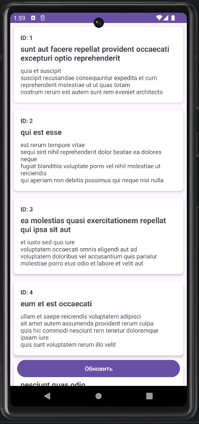
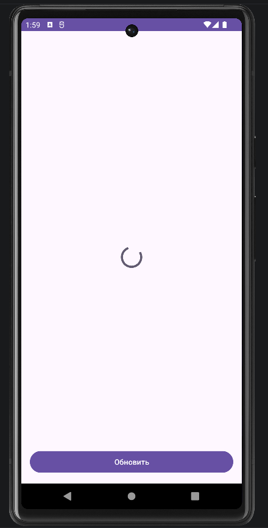
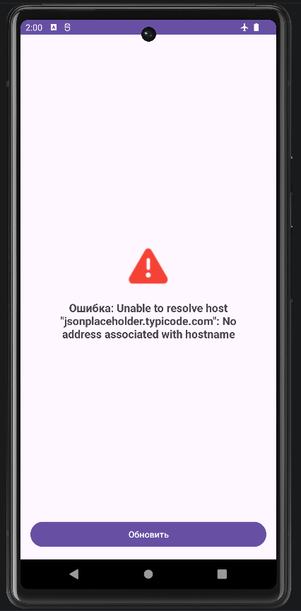
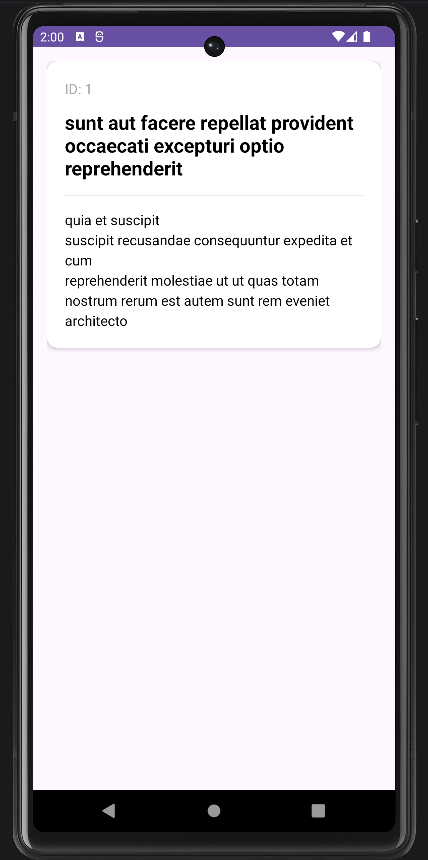

<div align="center">

**МИНИСТЕРСТВО НАУКИ И ВЫСШЕГО ОБРАЗОВАНИЯ РОССИЙСКОЙ ФЕДЕРАЦИИФЕДЕРАЛЬНОЕ ГОСУДАРСТВЕННОЕ БЮДЖЕТНОЕ ОБРАЗОВАТЕЛЬНОЕ УЧРЕЖДЕНИЕ ВЫСШЕГО ОБРАЗОВАНИЯ**  
**«САХАЛИНСКИЙ ГОСУДАРСТВЕННЫЙ УНИВЕРСИТЕТ»**

<br>
<br>

Институт естественных наук и техносферной безопасности  
Кафедра информатики  
Ощепков Алексей

<br>
<br>
<br>
<br>

Лабораторная работа №13  
«Создание простого API клиента.»  
01.03.02 Прикладная математика и информатика  

<br>
<br>
<br>
<br>
<br>
<br>
<br>
<br>
<br>
<br>
<br>
<br>
<br>

<div align="right">
Научный руководитель<br>
Соболев Евгений Игоревич
</div>

<br>
<br>
<br>

г. Южно-Сахалинск  
2026 г.

</div>

---

# Л/р №13

## Создание простого API клиента. Запрос списка постов с jsonplaceholder.typicode.com.

**Цель работы:** Научиться выполнять сетевые запросы в Android-приложении с использованием библиотеки Retrofit и корутин, обрабатывать ответы сервера, парсить JSON-данные и отображать их в RecyclerView.

---

## 1. Листинг `Post.kt`.

```kotlin
package com.example.postsapp.models

import android.os.Parcel
import android.os.Parcelable

data class Post(
    val id: Int,
    val title: String,
    val body: String
) : Parcelable {
    
    constructor(parcel: Parcel) : this(
        id = parcel.readInt(),
        title = parcel.readString() ?: "",
        body = parcel.readString() ?: ""
    )

    override fun writeToParcel(parcel: Parcel, flags: Int) {
        parcel.writeInt(id)
        parcel.writeString(title)
        parcel.writeString(body)
    }

    override fun describeContents(): Int = 0

    companion object CREATOR : Parcelable.Creator<Post> {
        override fun createFromParcel(parcel: Parcel): Post = Post(parcel)
        override fun newArray(size: Int): Array<Post?> = arrayOfNulls(size)
    }
}
```

---

## 2. Листинг `ApiService.kt`.

```kotlin
package com.example.postsapp.api

import com.example.postsapp.models.Post
import retrofit2.http.GET

interface ApiService {
    @GET("posts")
    suspend fun getPosts(): List<Post>
}
```

---

## 3. Листинг `RetrofitClient.kt`.

```kotlin
package com.example.postsapp.api

import retrofit2.Retrofit
import retrofit2.converter.gson.GsonConverterFactory

object RetrofitClient {
    private const val BASE_URL = "https://jsonplaceholder.typicode.com/"

    private val retrofit = Retrofit.Builder()
        .baseUrl(BASE_URL)
        .addConverterFactory(GsonConverterFactory.create())
        .build()

    val apiService: ApiService = retrofit.create(ApiService::class.java)
}
```

---

## 4. Листинг `PostsRepository.kt`.

```kotlin
package com.example.postsapp.repositories

import com.example.postsapp.api.RetrofitClient
import com.example.postsapp.models.Post
import kotlinx.coroutines.Dispatchers
import kotlinx.coroutines.withContext

class PostsRepository {
    private val apiService = RetrofitClient.apiService

    suspend fun getPosts(): List<Post> = withContext(Dispatchers.IO) {
        apiService.getPosts()
    }
}
```

---

## 5. Листинг `PostsViewModel.kt`.

```kotlin
package com.example.postsapp.viewmodels

import androidx.lifecycle.ViewModel
import androidx.lifecycle.viewModelScope
import com.example.postsapp.models.Post
import com.example.postsapp.repositories.PostsRepository
import kotlinx.coroutines.flow.MutableStateFlow
import kotlinx.coroutines.flow.StateFlow
import kotlinx.coroutines.flow.asStateFlow
import kotlinx.coroutines.launch

sealed class PostsUiState {
    object Loading : PostsUiState()
    data class Success(val posts: List<Post>) : PostsUiState()
    data class Error(val message: String) : PostsUiState()
}

class PostsViewModel : ViewModel() {
    private val repository = PostsRepository()

    private val _uiState = MutableStateFlow<PostsUiState>(PostsUiState.Loading)
    val uiState: StateFlow<PostsUiState> = _uiState.asStateFlow()

    init {
        loadPosts()
    }

    fun loadPosts() {
        viewModelScope.launch {
            _uiState.value = PostsUiState.Loading
            try {
                val posts = repository.getPosts()
                _uiState.value = PostsUiState.Success(posts)
            } catch (e: Exception) {
                _uiState.value = PostsUiState.Error(e.message ?: "Unknown error")
            }
        }
    }
}
```

---

## 6. Листинг `PostsAdapter.kt`.

```kotlin
package com.example.postsapp.adapters

import android.view.LayoutInflater
import android.view.ViewGroup
import androidx.recyclerview.widget.RecyclerView
import com.example.postsapp.databinding.ItemPostBinding
import com.example.postsapp.models.Post

class PostsAdapter(
    private val onItemClick: (Post) -> Unit
) : RecyclerView.Adapter<PostsAdapter.PostViewHolder>() {

    private var posts = emptyList<Post>()

    fun submitList(newPosts: List<Post>) {
        posts = newPosts
        notifyDataSetChanged()
    }

    override fun onCreateViewHolder(parent: ViewGroup, viewType: Int): PostViewHolder {
        val binding = ItemPostBinding.inflate(LayoutInflater.from(parent.context), parent, false)
        return PostViewHolder(binding)
    }

    override fun onBindViewHolder(holder: PostViewHolder, position: Int) {
        holder.bind(posts[position])
    }

    override fun getItemCount() = posts.size

    inner class PostViewHolder(private val binding: ItemPostBinding) :
        RecyclerView.ViewHolder(binding.root) {

        fun bind(post: Post) {
            binding.textPostId.text = "ID: ${post.id}"
            binding.textPostTitle.text = post.title
            binding.textPostBody.text = post.body

            // Обработка клика на весь элемент
            binding.root.setOnClickListener {
                onItemClick(post)
            }
        }
    }
}
```

---

## 7. Листинг `MainActivity.kt`.

```kotlin
package com.example.postsapp

import android.os.Bundle
import android.view.View
import androidx.activity.viewModels
import androidx.appcompat.app.AppCompatActivity
import androidx.lifecycle.Lifecycle
import androidx.lifecycle.lifecycleScope
import androidx.lifecycle.repeatOnLifecycle
import androidx.recyclerview.widget.LinearLayoutManager
import com.example.postsapp.adapters.PostsAdapter
import com.example.postsapp.databinding.ActivityMainBinding
import com.example.postsapp.viewmodels.PostsUiState
import com.example.postsapp.viewmodels.PostsViewModel
import kotlinx.coroutines.launch

class MainActivity : AppCompatActivity() {

    private val viewModel: PostsViewModel by viewModels()
    private lateinit var binding: ActivityMainBinding
    private lateinit var adapter: PostsAdapter

    override fun onCreate(savedInstanceState: Bundle?) {
        super.onCreate(savedInstanceState)

        binding = ActivityMainBinding.inflate(layoutInflater)
        setContentView(binding.root)

        setupRecyclerView()
        observeUiState()

        binding.buttonRefresh.setOnClickListener {
            viewModel.loadPosts()
        }
    }

    private fun setupRecyclerView() {
        adapter = PostsAdapter { post ->
            val intent = android.content.Intent(this, PostDetailActivity::class.java).apply {
                putExtra("EXTRA_POST", post)
            }
            startActivity(intent)
        }
        binding.recyclerViewPosts.layoutManager = LinearLayoutManager(this)
        binding.recyclerViewPosts.adapter = adapter
    }

    private fun observeUiState() {
        lifecycleScope.launch {
            repeatOnLifecycle(Lifecycle.State.STARTED) {
                viewModel.uiState.collect { state ->
                    when (state) {
                        is PostsUiState.Loading -> showLoading()
                        is PostsUiState.Success -> showPosts(state.posts)
                        is PostsUiState.Error -> showError(state.message)
                    }
                }
            }
        }
    }

    private fun showLoading() {
        binding.recyclerViewPosts.visibility = View.GONE
        binding.layoutError.visibility = View.GONE
        binding.progressBar.visibility = View.VISIBLE
    }

    private fun showPosts(posts: List<com.example.postsapp.models.Post>) {
        binding.recyclerViewPosts.visibility = View.VISIBLE
        binding.layoutError.visibility = View.GONE
        binding.progressBar.visibility = View.GONE
        adapter.submitList(posts)
    }

    private fun showError(message: String) {
        binding.recyclerViewPosts.visibility = View.GONE
        binding.progressBar.visibility = View.GONE
        binding.layoutError.visibility = View.VISIBLE
        binding.textError.text = getString(R.string.error_message, message)
    }
}
```

---

## 8. Листинг `activity_main.xml`.

```kotlin
<?xml version="1.0" encoding="utf-8"?>
<FrameLayout xmlns:android="http://schemas.android.com/apk/res/android"
    xmlns:app="http://schemas.android.com/apk/res-auto"
    android:layout_width="match_parent"
    android:layout_height="match_parent">

    <!-- Список постов -->
    <androidx.recyclerview.widget.RecyclerView
        android:id="@+id/recyclerViewPosts"
        android:layout_width="match_parent"
        android:layout_height="match_parent"
        android:visibility="gone" />

    <!-- Прогресс-бар -->
    <ProgressBar
        android:id="@+id/progressBar"
        android:layout_width="wrap_content"
        android:layout_height="wrap_content"
        android:layout_gravity="center"
        android:visibility="gone" />

    <!-- Контейнер ошибки -->
    <LinearLayout
        android:id="@+id/layoutError"
        android:layout_width="wrap_content"
        android:layout_height="wrap_content"
        android:layout_gravity="center"
        android:orientation="vertical"
        android:gravity="center"
        android:visibility="gone">

        <!-- Иконка ошибки -->
        <ImageView
            android:id="@+id/imageErrorIcon"
            android:layout_width="64dp"
            android:layout_height="64dp"
            android:src="@android:drawable/ic_dialog_alert"
            app:tint="#F44336" />

        <!-- Текст ошибки -->
        <TextView
            android:id="@+id/textError"
            android:layout_width="wrap_content"
            android:layout_height="wrap_content"
            android:layout_marginTop="12dp"
            android:gravity="center"
            android:text="Ошибка загрузки"
            android:textSize="18sp"
            android:textStyle="bold"
            android:maxWidth="320dp"
            android:padding="8dp" />
    </LinearLayout>

    <!-- Кнопка  -->
    <Button
        android:id="@+id/buttonRefresh"
        android:layout_width="match_parent"
        android:layout_height="wrap_content"
        android:layout_gravity="bottom"
        android:layout_margin="16dp"
        android:text="Обновить"
        android:elevation="8dp" />

</FrameLayout>
```

---

## 9. Листинг `item_post.xml`.

```kotlin
<?xml version="1.0" encoding="utf-8"?>
<androidx.cardview.widget.CardView
    xmlns:android="http://schemas.android.com/apk/res/android"
    xmlns:app="http://schemas.android.com/apk/res-auto"
    android:layout_width="match_parent"
    android:layout_height="wrap_content"
    android:layout_margin="8dp"
    app:cardCornerRadius="8dp"
    app:cardElevation="4dp">

    <LinearLayout
        android:layout_width="match_parent"
        android:layout_height="wrap_content"
        android:orientation="vertical"
        android:padding="16dp">

        <TextView
            android:id="@+id/textPostId"
            android:layout_width="wrap_content"
            android:layout_height="wrap_content"
            android:text="ID: "
            android:textStyle="bold"
            android:textSize="14sp"/>

        <TextView
            android:id="@+id/textPostTitle"
            android:layout_width="wrap_content"
            android:layout_height="wrap_content"
            android:text="Title"
            android:textSize="18sp"
            android:textStyle="bold"
            android:layout_marginTop="4dp"/>

        <TextView
            android:id="@+id/textPostBody"
            android:layout_width="wrap_content"
            android:layout_height="wrap_content"
            android:text="Body"
            android:textSize="14sp"
            android:layout_marginTop="8dp"/>

    </LinearLayout>
</androidx.cardview.widget.CardView>
```

---

## 10. Скриншоты работающего приложения.

## `Список постов`.


## `Состояние загрузки`.


## `Состояние ошибки`.


## `Индивидуальное задание №4`.


---

## 11. Ответы на контрольные вопросы.

**1. Для чего используется библиотека Retrofit? Какие аннотации вы знаете?**

***Ответ:*** Retrofit используется для выполнения HTTP-запросов и конвертации JSON-ответов в объекты Kotlin.

### Основные аннотации Retrofit

| Аннотация | Назначение |
|-----------|------------|
| `@GET` | GET-запрос для получения данных |
| `@POST` | POST-запрос для создания данных |
| `@PUT` | PUT-запрос для полного обновления |
| `@DELETE` | DELETE-запрос для удаления |
| `@PATCH` | PATCH-запрос для частичного обновления |
| `@Path` | Параметр пути в URL |
| `@Query` | Query-параметр в URL |
| `@Body` | Тело запроса (JSON-объект) |
| `@Header` | Заголовок HTTP-запроса |

**2. Почему сетевые запросы нельзя выполнять в главном потоке?**

***Ответ:*** Главный поток отвечает за отрисовку интерфейса. Блокировка его длительными операциями приводит к зависанию приложения.

**3. Что такое `suspend` функция и как она работает с корутинами?**

***Ответ:*** suspend это функция, которую можно приостановить и возобновить без блокировки потока. Она вызывается только внутри корутины. При приостановке поток освобождается для других задач, а после получения результата корутина продолжает выполнение.

**4. Для чего нужен `Dispatchers.IO`?**

***Ответ:*** Это планировщик корутин, оптимизированный для операций ввода-вывода. Он использует пул фоновых потоков, что позволяет выполнять долгие задачи, не влияя на интерфейс.

**5. Как обрабатывать ошибки при сетевых запросах?**

***Ответ:*** Ошибки ловятся конструкцией try-catch внутри корутины. При возникновении исключения в StateFlow отправляется состояние Error, после чего UI переключается на экран ошибки.

**6. Что такое JSONPlaceholder и для чего он используется?**

***Ответ:*** Это бесплатный тестовый REST API, предоставляющий фейковые данные для обучения. Имитирует работу реального сервера.

---

## 12. Вывод по работе.

В ходе выполнения лабораторной работы №13:
1. Освоил принципы асинхронной работы с сетью в Android.
2. Научился настраивать Retrofit для отправки GET-запросов, парсить JSON с помощью data class.
3. Научился использовать Kotlin Coroutines (suspend, viewModelScope, Dispatchers.IO) для фоновых операций без блокировки UI.

Выполнил индивидуальное задание 4.