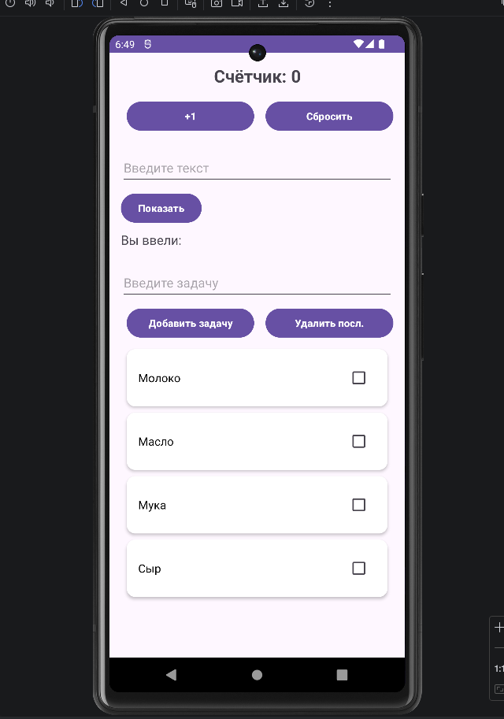
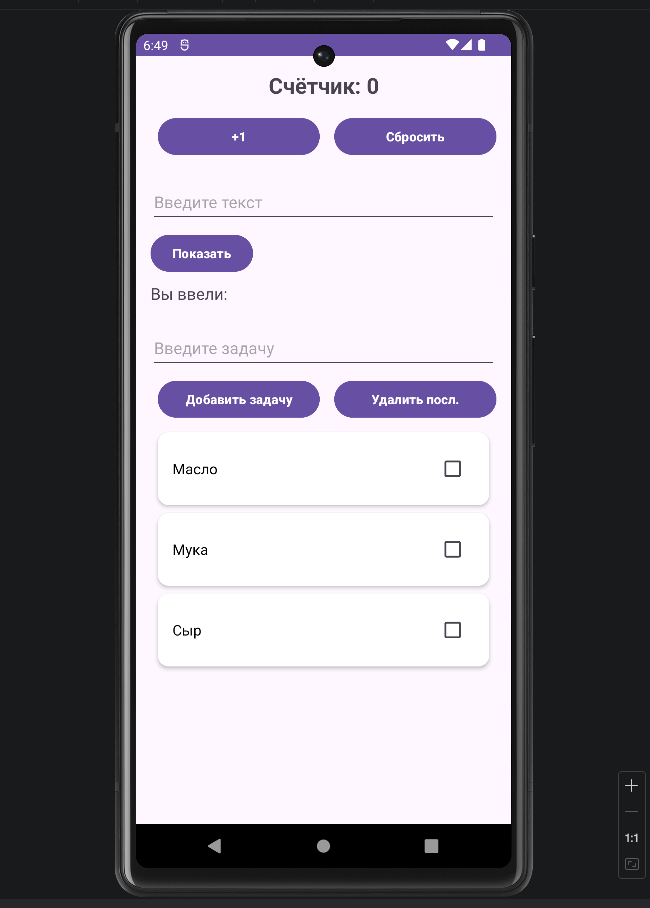
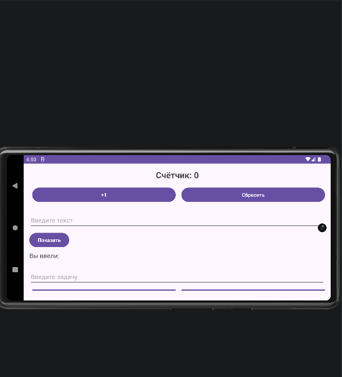

<div align="center">

**МИНИСТЕРСТВО НАУКИ И ВЫСШЕГО ОБРАЗОВАНИЯ РОССИЙСКОЙ ФЕДЕРАЦИИФЕДЕРАЛЬНОЕ ГОСУДАРСТВЕННОЕ БЮДЖЕТНОЕ ОБРАЗОВАТЕЛЬНОЕ УЧРЕЖДЕНИЕ ВЫСШЕГО ОБРАЗОВАНИЯ**  
**«САХАЛИНСКИЙ ГОСУДАРСТВЕННЫЙ УНИВЕРСИТЕТ»**

<br>
<br>

Институт естественных наук и техносферной безопасности  
Кафедра информатики  
Ощепков Алексей

<br>
<br>
<br>
<br>

Лабораторная работа №8  
«Использование StateFlow для хранения состояния.»  
01.03.02 Прикладная математика и информатика  

<br>
<br>
<br>
<br>
<br>
<br>
<br>
<br>
<br>
<br>
<br>
<br>
<br>

<div align="right">
Научный руководитель<br>
Соболев Евгений Игоревич
</div>

<br>
<br>
<br>

г. Южно-Сахалинск  
2026 г.

</div>

---

# Л/р №8

## Перенос логики списка задач из Activity в ViewModel. Использование StateFlow для хранения состояния.

**Цель работы:** Изучить архитектурный компонент ViewModel, научиться выносить логику и состояние UI из Activity, использовать StateFlow для реактивного обновления данных, обеспечить сохранение состояния при изменении конфигурации.

---

## 1. Листинг класса `MainViewModel.kt`.

```kotlin
package com.example.todoapp

import androidx.lifecycle.ViewModel
import kotlinx.coroutines.flow.MutableStateFlow
import kotlinx.coroutines.flow.StateFlow
import kotlinx.coroutines.flow.asStateFlow

class MainViewModel : ViewModel() {

    private val _tasks = MutableStateFlow<List<String>>(emptyList())

    val tasks: StateFlow<List<String>> = _tasks.asStateFlow()

    // Добавление задачи
    fun addTask(task: String) {
        val current = _tasks.value.toMutableList()
        current.add(task)
        _tasks.value = current
    }

    // Удаление задачи по индексу
    fun deleteTask(index: Int) {
        val current = _tasks.value.toMutableList()
        if (index in current.indices) {
            current.removeAt(index)
            _tasks.value = current
        }
    }

    //отмена удаления (идз. №4
    fun insertTask(index: Int, task: String) {
        val current = _tasks.value.toMutableList()
        if (index in 0..current.size) {
            current.add(index, task)
        } else {
            current.add(task)
        }
        _tasks.value = current
    }

    // Обновление текста
    fun updateTask(index: Int, newText: String) {
        val current = _tasks.value.toMutableList()
        if (index in current.indices) {
            current[index] = newText
            _tasks.value = current
        }
    }

    // Тест
    fun loadTestData() {
        if (_tasks.value.isEmpty()) {
            _tasks.value = listOf(
                "Молоко",
                "Масло",
                "Мука",
                "Сыр"
            )
        }
    }
}
```

---

## 2. Листинг  обновлённого `MainActivity.kt`.

```kotlin
package com.example.todoapp

import android.content.Intent
import android.os.Bundle
import android.widget.Button
import android.widget.EditText
import android.widget.TextView
import android.widget.Toast
import androidx.activity.viewModels
import androidx.appcompat.app.AppCompatActivity
import androidx.lifecycle.Lifecycle
import androidx.lifecycle.lifecycleScope
import androidx.lifecycle.repeatOnLifecycle
import androidx.recyclerview.widget.ItemTouchHelper
import androidx.recyclerview.widget.LinearLayoutManager
import androidx.recyclerview.widget.RecyclerView
import com.google.android.material.snackbar.Snackbar
import kotlinx.coroutines.launch

class MainActivity : AppCompatActivity() {

    private val viewModel: MainViewModel by viewModels()
    private lateinit var adapter: TaskAdapter
    private lateinit var recyclerView: RecyclerView
    private var counter = 0
    private var lastDeletedTask: String? = null
    private var lastDeletedPosition: Int = -1

    override fun onCreate(savedInstanceState: Bundle?) {
        super.onCreate(savedInstanceState)
        setContentView(R.layout.activity_main)

        val textCounter = findViewById<TextView>(R.id.textCounter)
        val buttonIncrement = findViewById<Button>(R.id.buttonIncrement)
        val buttonReset = findViewById<Button>(R.id.buttonReset)

        // Восстановление счетчика при повороте
        if (savedInstanceState != null) {
            counter = savedInstanceState.getInt("counter", 0)
        }
        updateCounterDisplay(textCounter)

        buttonIncrement.setOnClickListener {
            counter++
            updateCounterDisplay(textCounter)
        }

        buttonReset.setOnClickListener {
            counter = 0
            updateCounterDisplay(textCounter)
            Toast.makeText(this, R.string.toast_counter_reset, Toast.LENGTH_SHORT).show()
        }

        // Показ текста
        val editTextInput = findViewById<EditText>(R.id.editTextInput)
        val buttonShow = findViewById<Button>(R.id.buttonShow)
        val textEntered = findViewById<TextView>(R.id.textEntered)

        buttonShow.setOnClickListener {
            val inputText = editTextInput.text.toString()
            if (inputText.isNotBlank()) {
                textEntered.text = getString(R.string.label_entered_with_text, inputText)
            } else {
                textEntered.text = getString(R.string.label_entered)
            }
        }

        //ЛР8
        val editTextTask = findViewById<EditText>(R.id.editTextTask)
        val buttonAddTask = findViewById<Button>(R.id.buttonAddTask)
        val buttonRemoveLast = findViewById<Button>(R.id.buttonRemoveLast)

        recyclerView = findViewById(R.id.recyclerViewTasks)

        // Настройка RecyclerView
        recyclerView.layoutManager = LinearLayoutManager(this)
        adapter = TaskAdapter(
            tasks = emptyList(),
            onItemClick = { position -> openTaskDetail(position) },
            onItemLongClick = { position ->
                viewModel.deleteTask(position)
                Toast.makeText(this, "Задача удалена удерживанием", Toast.LENGTH_SHORT).show()
            }
        )
        recyclerView.adapter = adapter

        // Подписка на StateFlow
        lifecycleScope.launch {
            repeatOnLifecycle(Lifecycle.State.STARTED) {
                viewModel.tasks.collect { tasks ->
                    adapter.updateData(tasks)
                }
            }
        }

        // Добавление задачи
        buttonAddTask.setOnClickListener {
            val task = editTextTask.text.toString().trim()
            if (task.isNotBlank()) {
                viewModel.addTask(task)
                editTextTask.text.clear()
            } else {
                Toast.makeText(this, R.string.toast_empty_task, Toast.LENGTH_SHORT).show()
            }
        }

        // Удаление последней задачи
        buttonRemoveLast.setOnClickListener {
            val currentTasks = viewModel.tasks.value
            if (currentTasks.isNotEmpty()) {
                viewModel.deleteTask(currentTasks.size - 1)
                Toast.makeText(this, "Последняя задача удалена", Toast.LENGTH_SHORT).show()
            } else {
                Toast.makeText(this, R.string.toast_list_empty, Toast.LENGTH_SHORT).show()
            }
        }

        viewModel.loadTestData()

        //свайпа для удаления
        setupSwipeToDelete()
    }

    // Сохранение состояния счетчика
    override fun onSaveInstanceState(outState: Bundle) {
        super.onSaveInstanceState(outState)
        outState.putInt("counter", counter)
    }

    private fun updateCounterDisplay(textView: TextView) {
        textView.text = getString(R.string.counter_text, counter)
    }

    // ItemTouchHelper
    private fun setupSwipeToDelete() {
        val swipeCallback = object : ItemTouchHelper.SimpleCallback(
            0,
            ItemTouchHelper.LEFT or ItemTouchHelper.RIGHT
        ) {
            override fun onMove(
                recyclerView: RecyclerView,
                viewHolder: RecyclerView.ViewHolder,
                target: RecyclerView.ViewHolder
            ): Boolean = false

            override fun onSwiped(viewHolder: RecyclerView.ViewHolder, direction: Int) {
                val position = viewHolder.adapterPosition
                if (position == RecyclerView.NO_POSITION) return

                // Сохранение для отмены
                lastDeletedTask = viewModel.tasks.value.getOrNull(position)
                lastDeletedPosition = position

                // Удаляем через ViewModel
                viewModel.deleteTask(position)

                // Snackbar
                Snackbar.make(recyclerView, "Задача удалена свайпом", Snackbar.LENGTH_LONG)
                    .setAction("Отмена") {
                        lastDeletedTask?.let { text ->
                            viewModel.insertTask(lastDeletedPosition, text)
                        }
                    }
                    .show()
            }
        }
        ItemTouchHelper(swipeCallback).attachToRecyclerView(recyclerView)
    }

    private val detailResultLauncher = registerForActivityResult(
        androidx.activity.result.contract.ActivityResultContracts.StartActivityForResult()
    ) { result ->
        if (result.resultCode == RESULT_OK) {
            val actionType = result.data?.getStringExtra("action_type")
            val position = result.data?.getIntExtra(DetailActivity.RESULT_KEY_POSITION, -1) ?: -1

            when (actionType) {
                "updated" -> {
                    val newText = result.data?.getStringExtra(DetailActivity.RESULT_KEY_TEXT)
                    if (position != -1 && newText != null) {
                        viewModel.updateTask(position, newText)
                    }
                }
                "deleted" -> {
                    if (position != -1) {
                        viewModel.deleteTask(position)
                    }
                }
            }
        }
    }

    private fun openTaskDetail(position: Int) {
        val intent = Intent(this, DetailActivity::class.java).apply {
            putExtra(DetailActivity.EXTRA_TASK_TEXT, viewModel.tasks.value[position])
            putExtra(DetailActivity.EXTRA_TASK_POSITION, position)
        }
        detailResultLauncher.launch(intent)
    }
}
```

---

## 3. Листинг обновлённого `TaskAdapter.kt`.

```kotlin
package com.example.todoapp

import android.view.LayoutInflater
import android.view.View
import android.view.ViewGroup
import android.widget.CheckBox
import android.widget.TextView
import androidx.recyclerview.widget.RecyclerView

class TaskAdapter(
    private var tasks: List<String>,
    private val onItemClick: (Int) -> Unit,
    private val onItemLongClick: (Int) -> Unit
) : RecyclerView.Adapter<TaskAdapter.TaskViewHolder>() {

    class TaskViewHolder(itemView: View) : RecyclerView.ViewHolder(itemView) {
        val textTask: TextView = itemView.findViewById(R.id.textTask)
        val checkTask: CheckBox = itemView.findViewById(R.id.checkTask)
    }

    override fun onCreateViewHolder(parent: ViewGroup, viewType: Int): TaskViewHolder {
        val view = LayoutInflater.from(parent.context)
            .inflate(R.layout.item_task, parent, false)
        return TaskViewHolder(view)
    }

    override fun onBindViewHolder(holder: TaskViewHolder, position: Int) {
        val task = tasks[position]
        holder.textTask.text = task
        holder.checkTask.isChecked = false

        // Клик
        holder.itemView.setOnClickListener { onItemClick(position) }

        // Долгий клик
        holder.itemView.setOnLongClickListener {
            onItemLongClick(position)
            true
        }

        // Чекбокс. перечёркивание
        holder.checkTask.setOnCheckedChangeListener { _, isChecked ->
            if (isChecked) {
                holder.textTask.paintFlags = holder.textTask.paintFlags or android.graphics.Paint.STRIKE_THRU_TEXT_FLAG
            } else {
                holder.textTask.paintFlags = holder.textTask.paintFlags and android.graphics.Paint.STRIKE_THRU_TEXT_FLAG.inv()
            }
        }
    }

    override fun getItemCount(): Int = tasks.size

    // Обновление данных из ViewModel
    fun updateData(newTasks: List<String>) {
        tasks = newTasks
        notifyDataSetChanged()
    }
}
```

---

## 4. Скриншоты приложения.

## `Cписок задач`.


## `1 задача удалена`.


## `Поворот экрана`.


## `После поворота экрана`.


---

## 5. Ответы на контрольные вопросы.

**1. Для чего нужен ViewModel? Как он помогает при повороте экрана?**

***Ответ:*** `ViewModel` предназначен для хранения UI-данных и логики, отделяя их от жизненного цикла `Activity`. При повороте экрана `Activity` пересоздаётся, но экземпляр `ViewModel` сохраняется, поэтому данные не теряются.

**2. Чем StateFlow отличается от LiveData? В каких случаях предпочтительнее использовать StateFlow?**

***Ответ:*** `StateFlow` всегда имеет начальное значение, он не привязан к фреймворку и работает с корутинами. `LiveData` это класс с автоматической привязкой к `Lifecycle`. `StateFlow` предпочтительнее при работе с корутинами.

**3. Что такое `lifecycleScope` и `repeatOnLifecycle`? Зачем они нужны при подписке на StateFlow?**

***Ответ:*** `lifecycleScope` это область корутин, привязанная к `LifecycleOwner`, которая автоматически отменяет задачи при уничтожении компонента. `repeatOnLifecycle` это функция, которая запускает сбор данных только когда `Activity` находится в заданном состоянии. Они нужны предотвращения утечек памяти.

**4. Как обновить данные в StateFlow?**

***Ответ:*** Чтобы обновить данные в `StateFlow` надо присвоить новое значение свойству `.value.` через `MutableStateFlow`.

**5. Какие преимущества даёт вынос логики в ViewModel с точки зрения тестирования?**

***Ответ:*** Вынос логики в `ViewModel` ускоряет разработку и повышает надёжность кода.

---

## 6. Вывод по работе.

В ходе выполнения лабораторной работы №8:
1. Изучил компонент ViewModel 
2. Научился выносить хранение состояния из Activity. 
3. Освоил использование StateFlow для обновления UI.

Выполнил индивидуальное задание 4.