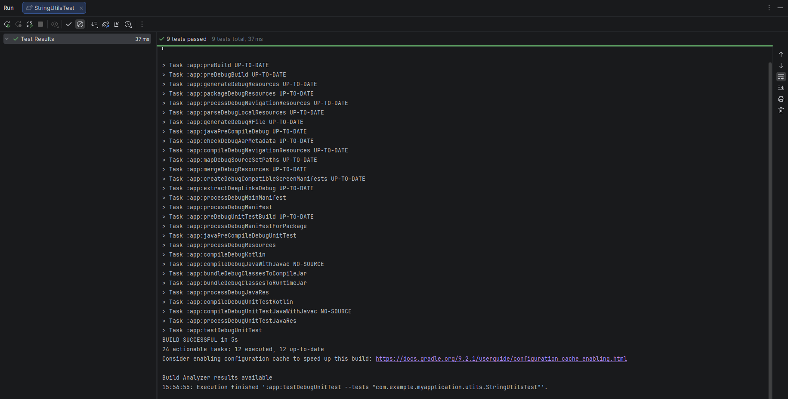
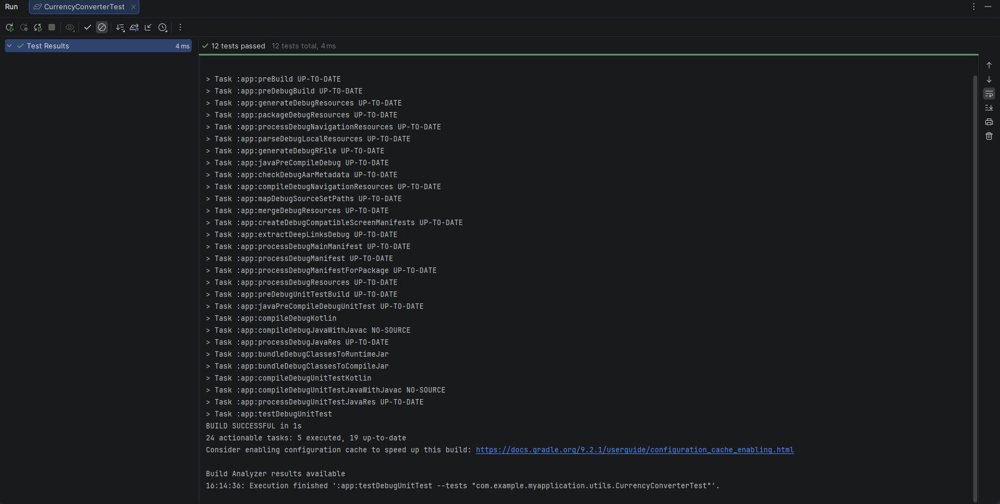

<div align="center">

**МИНИСТЕРСТВО НАУКИ И ВЫСШЕГО ОБРАЗОВАНИЯ РОССИЙСКОЙ ФЕДЕРАЦИИФЕДЕРАЛЬНОЕ ГОСУДАРСТВЕННОЕ БЮДЖЕТНОЕ ОБРАЗОВАТЕЛЬНОЕ УЧРЕЖДЕНИЕ ВЫСШЕГО ОБРАЗОВАНИЯ**  
**«САХАЛИНСКИЙ ГОСУДАРСТВЕННЫЙ УНИВЕРСИТЕТ»**

<br>
<br>

Институт естественных наук и техносферной безопасности  
Кафедра информатики  
Ощепков Алексей

<br>
<br>
<br>
<br>

Лабораторная работа №2  
«Написание консольных утилит на Kotlin внутри Android проекта.»  
01.03.02 Прикладная математика и информатика  

<br>
<br>
<br>
<br>
<br>
<br>
<br>
<br>
<br>
<br>
<br>
<br>
<br>

<div align="right">
Научный руководитель<br>
Соболев Евгений Игоревич
</div>

<br>
<br>
<br>

г. Южно-Сахалинск  
2026 г.

</div>

---

# Л/р №2

## Написание консольных утилит на Kotlin внутри Android проекта. Расчеты, работа со строками. Подготовка классов данных для будущего приложения.

**Цель работы:** Научиться создавать классы данных и функции-утилиты на Kotlin в контексте Android-проекта, освоить базовые приёмы работы со строками и числами, познакомиться с юнит-тестированием для проверки корректности кода.

---

## 1. Листинги классов данных и функций-утилит.

Класс `Book` в папке `app\src\main\java\utils\`.

```kotlin
package utils

data class Book(
    val title: String,
    val author: String,
    val year: Int,
    val price: Double
)
```

Файл `StringUtils.kt` в папке `app\src\main\java\utils\`.

```kotlin
package com.example.myapplication.utils

// Проверка, что строка похожа на email (содержит @ и .)
fun String.isValidEmail(): Boolean {
    return this.contains("@") && this.contains(".")
}

// Форматирование автора: "Толстой Л.Н."
fun formatAuthorName(fullName: String): String {
    val parts = fullName.split(" ").filter { it.isNotBlank() }
    return when (parts.size) {
        1 -> parts[0]
        2 -> "${parts[0]} ${parts[1].first()}."
        3 -> "${parts[0]} ${parts[1].first()}.${parts[2].first()}."
        else -> fullName
    }
}

// Применение скидки к цене книги
fun applyDiscount(price: Double, discountPercent: Double): Double {
    require(discountPercent in 0.0..100.0) { "Скидка должна быть от 0 до 100" }
    return price * (1 - discountPercent / 100)
}
```

### 1.1 Индивидуальное задание.
#### Конвертер валют.

Класс `CurrencyConverter` для конвертации валют. В папке `app\src\main\java\utils\`.

```kotlin
package com.example.myapplication.utils

// Класс для конвертации
data class CurrencyConverter(
    val baseCurrency: String
) {
    //RUB -> USD
    fun rubToUsd(amountRub: Double, rubToUsdRate: Double): Double {
        // сумма не отрицательная
        require(amountRub >= 0) { "Сумма не может быть отрицательной" }

        //  курс положительный
        require(rubToUsdRate > 0) { "Курс должен быть положительным" }

        // Конвертация
        // 9050 рублей / 90.5 = 100 долларов
        return amountRub / rubToUsdRate
    }

    //USD -> RUB
    fun usdToRub(amountUsd: Double, rubToUsdRate: Double): Double {
        require(amountUsd >= 0) { "Сумма не может быть отрицательной" }
        require(rubToUsdRate > 0) { "Курс должен быть положительным" }

        // Конвертация
        // 100 долларов * 90.5 = 9050 рублей
        return amountUsd * rubToUsdRate
    }

    //RUB -> EUR
    fun rubToEur(amountRub: Double, rubToEurRate: Double): Double {
        require(amountRub >= 0) { "Сумма не может быть отрицательной" }
        require(rubToEurRate > 0) { "Курс должен быть положительным" }

        // рубли / курс евро
        return amountRub / rubToEurRate
    }

    //EUR -> RUB
    fun eurToRub(amountEur: Double, rubToEurRate: Double): Double {
        require(amountEur >= 0) { "Сумма не может быть отрицательной" }
        require(rubToEurRate > 0) { "Курс должен быть положительным" }

        //евро * курс
        return amountEur * rubToEurRate
    }

    //USD → RUB → EUR
    fun usdToEur(amountUsd: Double, rubToUsdRate: Double, rubToEurRate: Double): Double {
        // доллары в рубли
        val amountInRub = usdToRub(amountUsd, rubToUsdRate)

        //  рубли в евро
        return rubToEur(amountInRub, rubToEurRate)
    }

    //EUR → RUB → USD
    fun eurToUsd(amountEur: Double, rubToUsdRate: Double, rubToEurRate: Double): Double {
        // евро в рубли
        val amountInRub = eurToRub(amountEur, rubToEurRate)

        // рубли в доллары
        return rubToUsd(amountInRub, rubToUsdRate)
    }
}
```

---

## 2. Листинги юнит-тестов.

Класс `StringUtilsTest` для проверки функций. В папке `app\src\test\java\utils\`.

```kotlin
package com.example.myapplication.utils

import org.junit.Assert.*
import org.junit.Test

class StringUtilsTest {

    @Test
    fun emailValidation_correct() {
        assertTrue("test@example.com".isValidEmail())
        assertTrue("user.name@domain.co".isValidEmail())
    }

    @Test
    fun emailValidation_incorrect() {
        assertFalse("testexample.com".isValidEmail())
        assertFalse("test@example".isValidEmail())
        assertFalse(" ".isValidEmail())
    }

    @Test
    fun formatAuthorName_fullName() {
        assertEquals("Толстой Л.Н.", formatAuthorName("Толстой Лев Николаевич"))
        assertEquals("Пушкин А.С.", formatAuthorName("Пушкин Александр Сергеевич"))
    }

    @Test
    fun formatAuthorName_twoParts() {
        assertEquals("Толстой Л.", formatAuthorName("Толстой Лев"))
        assertEquals("Пушкин А.", formatAuthorName("Пушкин Александр"))
    }

    @Test
    fun formatAuthorName_onePart() {
        assertEquals("Толстой", formatAuthorName("Толстой"))
    }

    @Test
    fun applyDiscount_normal() {
        assertEquals(90.0, applyDiscount(100.0, 10.0), 0.001)
        assertEquals(75.0, applyDiscount(150.0, 50.0), 0.001)
    }

    @Test
    fun applyDiscount_zero() {
        assertEquals(100.0, applyDiscount(100.0, 0.0), 0.001)
    }

    @Test(expected = IllegalArgumentException::class)
    fun applyDiscount_invalidLow() {
        applyDiscount(100.0, -5.0)
    }

    @Test(expected = IllegalArgumentException::class)
    fun applyDiscount_invalidHigh() {
        applyDiscount(100.0, 110.0)
    }
}

```
### 2.1 Индивидуальное задание.
#### Конвертер валют.

Класс `CurrencyConverterTest` для проверки функций конвертации валют. В папке `app\src\test\java\utils\`.

```kotlin
package com.example.myapplication.utils

import org.junit.Assert.*
import org.junit.Test

class CurrencyConverterTest {

    //RUB -> USD
    //обычная конвертация
    @Test
    fun rubToUsd_normalConversion() {
        val converter = CurrencyConverter("RUB")
        val result = converter.rubToUsd(9050.0, 90.5)
        assertEquals(100.0, result, 0.001)
    }

    //конвертация 0 рублей
    @Test
    fun rubToUsd_zeroAmount() {
        val converter = CurrencyConverter("RUB")
        val result = converter.rubToUsd(0.0, 90.5)

        // 0 рублей = 0 долларов
        assertEquals(0.0, result, 0.001)
    }

    //конвертация отрицательного значения
    @Test(expected = IllegalArgumentException::class)
    fun rubToUsd_negativeAmount() {
        val converter = CurrencyConverter("RUB")
        converter.rubToUsd(-100.0, 90.5)
    }

    //некорректный курс 0
    @Test(expected = IllegalArgumentException::class)
    fun rubToUsd_invalidRate() {
        val converter = CurrencyConverter("RUB")
        converter.rubToUsd(100.0, 0.0)
    }

    //USD -> RUB

    //обычная конвертация
    @Test
    fun usdToRub_normalConversion() {
        val converter = CurrencyConverter("RUB")
        // 100 долларов = 9050 рублей
        val result = converter.usdToRub(100.0, 90.5)
        assertEquals(9050.0, result, 0.001)
    }

    //дробная сумма долларов
    @Test
    fun usdToRub_fractionalAmount() {
        val converter = CurrencyConverter("RUB")
        // 50.75 долларов * 90.5 = 4592.875 рублей
        val result = converter.usdToRub(50.75, 90.5)
        assertEquals(4592.875, result, 0.001)
    }

    //RUB -> EUR

    //обычная конвертация
    @Test
    fun rubToEur_normalConversion() {
        val converter = CurrencyConverter("RUB")
        // 9800 рублей / 98.0 = 100 евро
        val result = converter.rubToEur(9800.0, 98.0)
        assertEquals(100.0, result, 0.001)
    }

    //EUR -> RUB

    //обычная конвертация
    @Test
    fun eurToRub_normalConversion() {
        val converter = CurrencyConverter("RUB")
        // 100 евро * 98.0 = 9800 рублей
        val result = converter.eurToRub(100.0, 98.0)
        assertEquals(9800.0, result, 0.001)
    }

    // конвертация долларов в евро через рубли USD → RUB → EUR
    @Test
    fun usdToEur_crossRate() {
        val converter = CurrencyConverter("RUB")
        // 100 долларов
        // 1 USD = 90.5 RUB
        // 1 EUR = 98.0 RUB

        // 1 step: 100 USD * 90.5 = 9050 RUB
        // 2 step: 9050 RUB / 98.0 = 92.3469387755... EUR
        val result = converter.usdToEur(100.0, 90.5, 98.0)
        assertEquals(92.3469387755, result, 0.001)
    }

    //конвертация евро в доллары через рубли EUR → RUB → USD
    @Test
    fun eurToUsd_crossRate() {
        val converter = CurrencyConverter("RUB")
        // 100 евро
        // 1 USD = 90.5 RUB
        // 1 EUR = 98.0 RUB

        // 1 step: 100 EUR * 98.0 = 9800 RUB
        // 2 step: 9800 RUB / 90.5 = 108.2872928176... USD
        val result = converter.eurToUsd(100.0, 90.5, 98.0)
        assertEquals(108.2872928176, result, 0.001)
    }

    // Валидация

    //отрицательный курс при USD -> RUB

    @Test(expected = IllegalArgumentException::class)
    fun usdToRub_negativeRate() {
        val converter = CurrencyConverter("RUB")
        converter.usdToRub(100.0, -90.5)
    }

    // отрицательная сумма при RUB -> EUR
    @Test(expected = IllegalArgumentException::class)
    fun rubToEur_negativeAmount() {
        val converter = CurrencyConverter("RUB")
        converter.rubToEur(-500.0, 98.0)
    }
}
```

---

## 3. Скриншоты успешного выполнения тестов

### Результат юнит-теста `StringUtilsTest`:


### Результат юнит-теста `CurrencyConverterTest`:


---

## 4. Ответы на контрольные вопросы.

**1. Для чего в Kotlin используются data class?**

***Ответ:*** data class в Kotlin предназначены для хранения данных (состояния объекта). Без data class все методы пришлось бы писать вручную, что увеличивает объём кода и риск ошибок.

**2. Чем отличается функция расширения от обычной функции?**

***Ответ:*** Функция расширения позволяет добавлять новые функции к существующим классам без изменения их исходного кода и без наследования.

**3. Как запустить юнит-тесты в Android Studio?**

***Ответ:***

Через контекстное меню:
ПКМ на файле теста → Run 'Имя_файла'
ПКМ на методе теста → Run 'Имя_метода'

Через Main Menu `"ALT + \"`:
Run → Run... → выбрать нужный тест из списка

С помощью горячих клавиш:
`Shift + F10`


**4. Что такое `assertEquals` и для чего нужен третий параметр (дельта) при сравнении вещественных чисел?**

***Ответ:*** `assertEquals(expected, actual, delta)` — это метод из **библиотеки JUnit** для проверки равенства двух значений. Операции с вещественными числами `(Float, Double)` выполняются с ограниченной точностью. Это может приводить к ошибкам округления. По этому мы используем параметр `delta`.

**5. В какой директории проекта хранятся тесты, выполняющиеся на JVM?**

***Ответ:*** Тесты, выполняющиеся на JVM, хранятся в директории: `app/src/test/java/`

---

## 5. Вывод по работе.

В ходе выполнения лабораторной работы №2 было изучено и выполнено следующее:

**1. Работа с классами данных (data class).**

Научился создавать классы для хранения информации, используя автоматическую генерацию методов `toString()`, `equals()`, `copy()`.

**2. Создание функций-утилит.**

Реализовал функции для обработки строк `(isValidEmail, formatAuthorName)` и чисел `(applyDiscount)`, освоил использование функции `require()` для валидации входных параметров.

**3. Функции расширения Kotlin.**

Изучил синтаксис и преимущества функций расширения, которые позволяют добавлять новую функциональность к существующим классам без их модификации.

**4. Юнит-тестирование с JUnit.**

Написал набор тестов для проверки корректности работы функций, научился использовать, методы `assertEquals`, `assertTrue`, `assertFalse`, а также обрабатывать исключения через `expected = IllegalArgumentException::class`.

**5. Работа с погрешностями вещественных чисел.**

Освоил использование параметра `delta` в `assertEquals` для корректного сравнения значений типов `Double` и `Float`.

**6. Индивидуальное задание: Конвертер валют.**

Реализовал класс `CurrencyConverter` с методами для конвертации между **RUB**, **USD** и **EUR**. Проферил функционал с помощью юнит-тестов.

**7. Организация структуры проекта.**

Научился правильно разделять основной код `(src/main)` и тесты `(src/test)`.