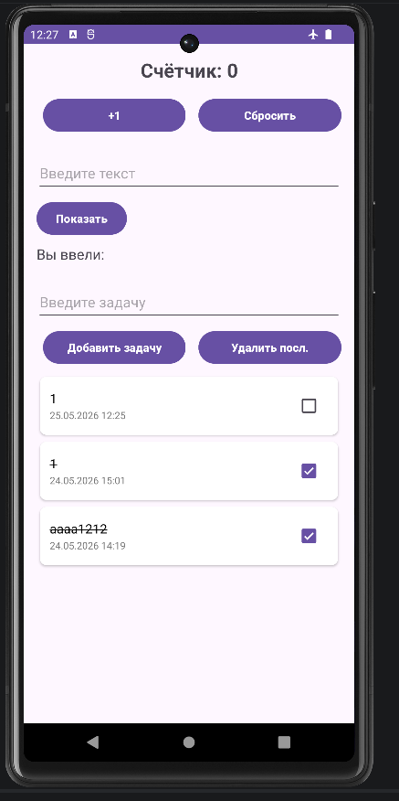
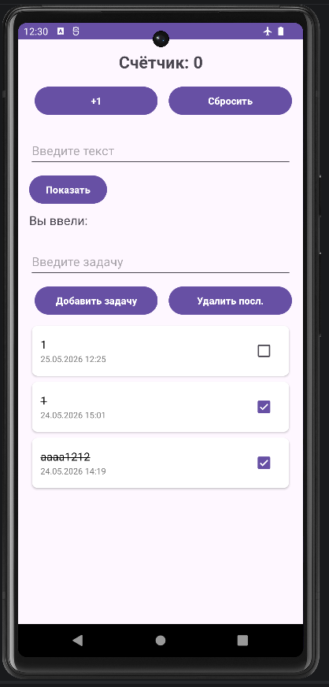

<div align="center">

**МИНИСТЕРСТВО НАУКИ И ВЫСШЕГО ОБРАЗОВАНИЯ РОССИЙСКОЙ ФЕДЕРАЦИИФЕДЕРАЛЬНОЕ ГОСУДАРСТВЕННОЕ БЮДЖЕТНОЕ ОБРАЗОВАТЕЛЬНОЕ УЧРЕЖДЕНИЕ ВЫСШЕГО ОБРАЗОВАНИЯ**  
**«САХАЛИНСКИЙ ГОСУДАРСТВЕННЫЙ УНИВЕРСИТЕТ»**

<br>
<br>

Институт естественных наук и техносферной безопасности  
Кафедра информатики  
Ощепков Алексей

<br>
<br>
<br>
<br>

Лабораторная работа №10  
«Интеграция Room в проект.»  
01.03.02 Прикладная математика и информатика  

<br>
<br>
<br>
<br>
<br>
<br>
<br>
<br>
<br>
<br>
<br>
<br>
<br>

<div align="right">
Научный руководитель<br>
Соболев Евгений Игоревич
</div>

<br>
<br>
<br>

г. Южно-Сахалинск  
2026 г.

</div>

---

# Л/р №10

## Интеграция Room в проект. Сохранение списка задач в БД.

**Цель работы:**  Изучить основы работы с Room Database — официальной библиотекой для работы с SQLite в Android. Научиться создавать Entity, DAO, Database, интегрировать Room с ViewModel и корутинами, обеспечить сохранение списка задач между сессиями приложения.

---

## 1. Листинг `TaskEntity.kt`.

```kotlin
package com.example.todoapp.database

import androidx.room.Entity
import androidx.room.PrimaryKey

@Entity(tableName = "tasks") // Имя таблицы в БД
data class TaskEntity(
    @PrimaryKey(autoGenerate = true) // Автоматическая генерация ID
    val id: Long = 0,
    val title: String,          // Текст задачи
    val isCompleted: Boolean = false, // Статус выполнения
    val createdTime: Long = System.currentTimeMillis() // Время создания для сортировки
)
```

---

## 2. Листинг `TaskDao.kt`.

```kotlin
package com.example.todoapp.database

import androidx.room.*
import kotlinx.coroutines.flow.Flow

@Dao
interface TaskDao {
    
    @Query("SELECT * FROM tasks ORDER BY createdTime DESC")
    fun getAllTasks(): Flow<List<TaskEntity>>

    //Сортировка по статусу и дате
    @Query("SELECT * FROM tasks ORDER BY isCompleted ASC, createdTime DESC")
    fun getSortedTasks(): Flow<List<TaskEntity>>

    @Insert(onConflict = OnConflictStrategy.REPLACE)
    suspend fun insertTask(task: TaskEntity)

    @Update
    suspend fun updateTask(task: TaskEntity)

    @Delete
    suspend fun deleteTask(task: TaskEntity)

    @Query("DELETE FROM tasks")
    suspend fun deleteAll()

    @Query("SELECT * FROM tasks WHERE id = :id")
    suspend fun getTaskById(id: Long): TaskEntity?
}
```

---

## 3. Листинг `AppDatabase.kt`.

```kotlin
package com.example.todoapp.database

import android.content.Context
import androidx.room.Database
import androidx.room.Room
import androidx.room.RoomDatabase

@Database(
    entities = [TaskEntity::class],
    version = 1,
    exportSchema = false
)
abstract class AppDatabase : RoomDatabase() {

    abstract fun taskDao(): TaskDao

    companion object {
        @Volatile
        private var INSTANCE: AppDatabase? = null

        fun getInstance(context: Context): AppDatabase {
            return INSTANCE ?: synchronized(this) {
                val instance = Room.databaseBuilder(
                    context.applicationContext,
                    AppDatabase::class.java,
                    "todo_database"
                )
                    .build()
                INSTANCE = instance
                instance
            }
        }
    }
}
```

---

## 4. Листинг `MainViewModel.kt`.

```kotlin
package com.example.todoapp

import androidx.lifecycle.ViewModel
import androidx.lifecycle.viewModelScope
import com.example.todoapp.database.AppDatabase
import com.example.todoapp.database.TaskEntity
import kotlinx.coroutines.flow.SharingStarted
import kotlinx.coroutines.flow.StateFlow
import kotlinx.coroutines.flow.stateIn
import kotlinx.coroutines.launch

class MainViewModel(
    private val database: AppDatabase
) : ViewModel() {

    private val taskDao = database.taskDao()
    
    // Сначала невыполненные, потом новые сверху (createdTime DESC)
    val tasks: StateFlow<List<TaskEntity>> = taskDao.getSortedTasks()
        .stateIn(
            scope = viewModelScope,
            started = SharingStarted.WhileSubscribed(5000),
            initialValue = emptyList()
        )

    fun addTask(title: String) {
        viewModelScope.launch {
            taskDao.insertTask(TaskEntity(title = title))
        }
    }

    fun deleteTask(task: TaskEntity) {
        viewModelScope.launch {
            taskDao.deleteTask(task)
        }
    }

    fun toggleTaskCompletion(task: TaskEntity, isCompleted: Boolean) {
        viewModelScope.launch {
            taskDao.updateTask(task.copy(isCompleted = isCompleted))
        }
    }

    fun deleteAllTasks() {
        viewModelScope.launch {
            taskDao.deleteAll()
        }
    }
    
    fun updateTaskTitle(taskId: Long, newTitle: String) {
        viewModelScope.launch {
            val task = taskDao.getTaskById(taskId) ?: return@launch
            taskDao.updateTask(task.copy(title = newTitle))
        }
    }
    
    fun deleteTaskById(taskId: Long) {
        viewModelScope.launch {
            val task = taskDao.getTaskById(taskId) ?: return@launch
            taskDao.deleteTask(task)
        }
    }
    
    fun restoreTask(task: TaskEntity) {
        viewModelScope.launch {
            taskDao.insertTask(task)
        }
    }
}
```

---

## 5. Листинг `MainActivity.kt`.

```kotlin
package com.example.todoapp

import android.content.Intent
import android.os.Bundle
import android.widget.Button
import android.widget.EditText
import android.widget.TextView
import android.widget.Toast
import androidx.activity.result.contract.ActivityResultContracts
import androidx.activity.viewModels
import androidx.appcompat.app.AppCompatActivity
import androidx.lifecycle.Lifecycle
import androidx.lifecycle.lifecycleScope
import androidx.lifecycle.repeatOnLifecycle
import androidx.recyclerview.widget.ItemTouchHelper
import androidx.recyclerview.widget.LinearLayoutManager
import androidx.recyclerview.widget.RecyclerView
import com.example.todoapp.database.AppDatabase
import com.example.todoapp.database.TaskEntity
import com.google.android.material.snackbar.Snackbar
import kotlinx.coroutines.launch

class MainActivity : AppCompatActivity() {

    private val database by lazy { AppDatabase.getInstance(this) }
    private val viewModel: MainViewModel by viewModels { MainViewModelFactory(database) }

    private lateinit var adapter: TaskAdapter
    private lateinit var recyclerView: RecyclerView

    private var counter = 0
    private var lastDeletedTask: TaskEntity? = null

    override fun onCreate(savedInstanceState: Bundle?) {
        super.onCreate(savedInstanceState)
        setContentView(R.layout.activity_main)

        val textCounter = findViewById<TextView>(R.id.textCounter)
        val buttonIncrement = findViewById<Button>(R.id.buttonIncrement)
        val buttonReset = findViewById<Button>(R.id.buttonReset)

        if (savedInstanceState != null) counter = savedInstanceState.getInt("counter", 0)
        updateCounterDisplay(textCounter)

        buttonIncrement.setOnClickListener { counter++; updateCounterDisplay(textCounter) }
        buttonReset.setOnClickListener {
            counter = 0
            updateCounterDisplay(textCounter)
            Toast.makeText(this, R.string.toast_counter_reset, Toast.LENGTH_SHORT).show()
        }

        val editTextInput = findViewById<EditText>(R.id.editTextInput)
        val buttonShow = findViewById<Button>(R.id.buttonShow)
        val textEntered = findViewById<TextView>(R.id.textEntered)

        buttonShow.setOnClickListener {
            val input = editTextInput.text.toString().trim()
            textEntered.text = if (input.isNotBlank()) getString(R.string.label_entered_with_text, input) else getString(R.string.label_entered)
        }

        val editTextTask = findViewById<EditText>(R.id.editTextTask)
        val buttonAddTask = findViewById<Button>(R.id.buttonAddTask)
        val buttonRemoveLast = findViewById<Button>(R.id.buttonRemoveLast)
        recyclerView = findViewById(R.id.recyclerViewTasks)
        recyclerView.layoutManager = LinearLayoutManager(this)

        adapter = TaskAdapter(
            tasks = emptyList(),
            onItemClick = { task -> openTaskDetail(task) },
            onItemLongClick = { task ->
                viewModel.deleteTask(task)
                Toast.makeText(this, "Задача удалена (долгий клик)", Toast.LENGTH_SHORT).show()
            },
            onCheckChange = { task, isChecked -> viewModel.toggleTaskCompletion(task, isChecked) }
        )
        recyclerView.adapter = adapter

        lifecycleScope.launch {
            repeatOnLifecycle(Lifecycle.State.STARTED) {
                viewModel.tasks.collect { tasks -> adapter.updateData(tasks) }
            }
        }

        buttonAddTask.setOnClickListener {
            val task = editTextTask.text.toString().trim()
            if (task.isNotBlank()) { viewModel.addTask(task); editTextTask.text.clear() }
            else Toast.makeText(this, R.string.toast_empty_task, Toast.LENGTH_SHORT).show()
        }

        buttonRemoveLast.setOnClickListener {
            val current = viewModel.tasks.value
            if (current.isNotEmpty()) { viewModel.deleteTask(current.last()); Toast.makeText(this, "Последняя задача удалена", Toast.LENGTH_SHORT).show() }
            else Toast.makeText(this, R.string.toast_list_empty, Toast.LENGTH_SHORT).show()
        }

        setupSwipeToDelete()
    }

    override fun onSaveInstanceState(outState: Bundle) {
        super.onSaveInstanceState(outState)
        outState.putInt("counter", counter)
    }

    private fun updateCounterDisplay(tv: TextView) { tv.text = getString(R.string.counter_text, counter) }

    private fun setupSwipeToDelete() {
        val callback = object : ItemTouchHelper.SimpleCallback(0, ItemTouchHelper.LEFT or ItemTouchHelper.RIGHT) {
            override fun onMove(rv: RecyclerView, vh: RecyclerView.ViewHolder, target: RecyclerView.ViewHolder) = false
            override fun onSwiped(viewHolder: RecyclerView.ViewHolder, direction: Int) {
                val position = viewHolder.absoluteAdapterPosition
                if (position == RecyclerView.NO_POSITION) return

                lastDeletedTask = adapter.tasks.getOrNull(position)
                lastDeletedTask?.let { viewModel.deleteTask(it) }

                Snackbar.make(recyclerView, "Задача удалена", Snackbar.LENGTH_LONG)
                    .setAction("ОТМЕНА") {
                        lastDeletedTask?.let { viewModel.restoreTask(it) }
                    }.show()
            }
        }
        ItemTouchHelper(callback).attachToRecyclerView(recyclerView)
    }

    private val detailResultLauncher = registerForActivityResult(ActivityResultContracts.StartActivityForResult()) { result ->
        if (result.resultCode == RESULT_OK) {
            val action = result.data?.getStringExtra("action_type")
            val taskId = result.data?.getLongExtra("task_id", -1L) ?: -1L
            when (action) {
                "updated" -> {
                    val newText = result.data?.getStringExtra("task_text")
                    if (taskId != -1L && newText != null) viewModel.updateTaskTitle(taskId, newText)
                }
                "deleted" -> if (taskId != -1L) viewModel.deleteTaskById(taskId)
            }
        }
    }

    private fun openTaskDetail(task: TaskEntity) {
        val intent = Intent(this, DetailActivity::class.java).apply {
            putExtra("task_text", task.title)
            putExtra("task_id", task.id)
        }
        detailResultLauncher.launch(intent)
    }
}
```

---

## 6. Листинг `TaskAdapter.kt`.

```kotlin
package com.example.todoapp

import android.graphics.Paint
import android.view.LayoutInflater
import android.view.View
import android.view.ViewGroup
import android.widget.CheckBox
import android.widget.TextView
import android.widget.CompoundButton
import androidx.recyclerview.widget.RecyclerView
import com.example.todoapp.database.TaskEntity
import java.text.SimpleDateFormat
import java.util.Date
import java.util.Locale

class TaskAdapter(
    internal var tasks: List<TaskEntity>,
    private val onItemClick: (TaskEntity) -> Unit,
    private val onItemLongClick: (TaskEntity) -> Unit,
    private val onCheckChange: (TaskEntity, Boolean) -> Unit
) : RecyclerView.Adapter<TaskAdapter.TaskViewHolder>() {
    
    private val dateFormat = SimpleDateFormat("dd.MM.yyyy HH:mm", Locale.getDefault())

    class TaskViewHolder(itemView: View) : RecyclerView.ViewHolder(itemView) {
        val textTask: TextView = itemView.findViewById(R.id.textTask)
        val checkTask: CheckBox = itemView.findViewById(R.id.checkTask)
        val textDate: TextView = itemView.findViewById(R.id.textDate)
    }

    override fun onCreateViewHolder(parent: ViewGroup, viewType: Int): TaskViewHolder {
        val view = LayoutInflater.from(parent.context)
            .inflate(R.layout.item_task, parent, false)
        return TaskViewHolder(view)
    }

    override fun onBindViewHolder(holder: TaskViewHolder, position: Int) {
        val task = tasks[position]

        holder.textTask.text = task.title

        //Отображение даты создания
        val dateStr = dateFormat.format(Date(task.createdTime))
        holder.textDate.text = dateStr

        // Зачёркивание
        if (task.isCompleted) {
            holder.textTask.paintFlags = holder.textTask.paintFlags or Paint.STRIKE_THRU_TEXT_FLAG
        } else {
            holder.textTask.paintFlags = holder.textTask.paintFlags and Paint.STRIKE_THRU_TEXT_FLAG.inv()
        }

        // Чекбокс
        holder.checkTask.setOnCheckedChangeListener(null)
        holder.checkTask.isChecked = task.isCompleted
        holder.checkTask.setOnCheckedChangeListener { _: CompoundButton, isChecked: Boolean ->
            onCheckChange(task, isChecked)
        }

        holder.itemView.setOnClickListener { onItemClick(task) }
        holder.itemView.setOnLongClickListener {
            onItemLongClick(task)
            true
        }
    }

    override fun getItemCount(): Int = tasks.size

    fun updateData(newTasks: List<TaskEntity>) {
        tasks = newTasks
        notifyDataSetChanged()
    }
}
```

---

## 7. Скриншоты работающего приложения с демонстрацией сохранения данных после перезапуска.

## `Исходные данные (сортированные)`.


## `Данные после изменения`.


## `Данные после перезапуска`.


---

## 8. Ответы на контрольные вопросы.

**1. Для чего нужна библиотека Room? Какие проблемы она решает по сравнению с прямым использованием SQLite?**

***Ответ:*** Room устраняет шаблонный код, проверяет SQL-запросы на этапе компиляции, поддерживает корутины и `Flow`, что предотвращает блокировку UI-потока и упрощает архитектуру приложения.

**2. Назовите три основных компонента Room и объясните их назначение .**

***Ответ:*** 

1. `Entity` — класс данных, представляющий таблицу в базе данных. Каждое поле класса — это столбец таблицы.
2. `DAO` (Data Access Object) — интерфейс, определяющий методы для работы с данными (вставка, удаление, запросы). Room автоматически генерирует реализацию этого интерфейса.
3. `Database` — абстрактный класс, наследующий от RoomDatabase, который служит точкой доступа к базе данных. Он связывает Entity и DAO, а также управляет версионированием.

**3. Почему методы DAO, изменяющие данные, объявляются как `suspend`?**

***Ответ:*** Операции с БД могут занимать время и блокировать главный поток. `suspend` позволяет выполнять их асинхронно внутри корутин, не замораживая интерфейс.

**4. Что такое `Flow` и почему его удобно использовать с Room?**

***Ответ:*** `Flow` это асинхронный поток данных в Kotlin. Room возвращает `Flow` в запросах, что позволяет автоматически получать обновления при изменении таблицы. UI подписывается на поток и реактивно перерисовывается без ручных вызовов `notifyDataSetChanged()`.

**5. Как Room обеспечивает проверку SQL-запросов на этапе компиляции?**

***Ответ:*** Через процессор аннотаций (KSP/kapt). При сборке Room анализирует `@Query`, проверяет синтаксис, соответствие имён таблиц/столбцов из `@Entity` и типы данных. Ошибки выводятся сразу при компиляции, а не во время работы приложения.

**6. Зачем нужен паттерн Singleton для экземпляра базы данных?**

***Ответ:*** `Singleton` гарантирует создание только одного экземпляра `RoomDatabase` на всё приложение, что экономит память, предотвращает утечки, конфликты блокировок и обеспечивает целостность данных.

---

## 9. Вывод по работе.

В ходе выполнения лабораторной работы №10:
1. Изучил и интегрировал библиотеку Room.
2. Реализовал основные компоненты: Entity, DAO и Database.

Выполнил индивидуальное задание 1.