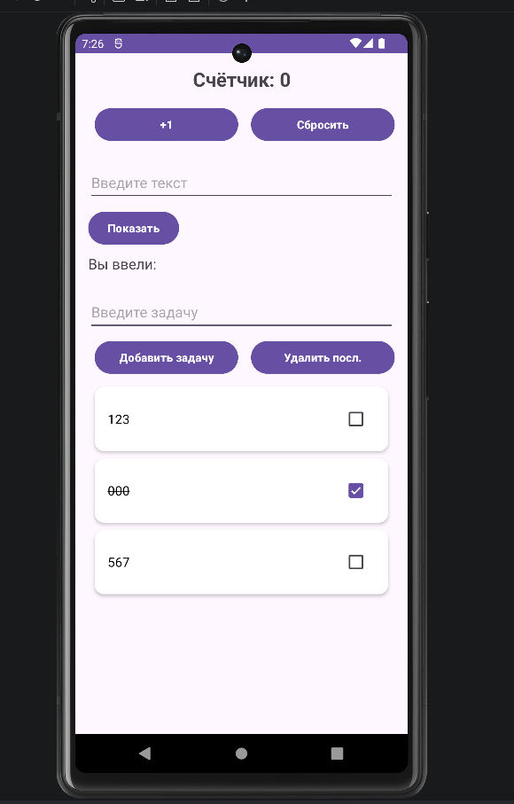
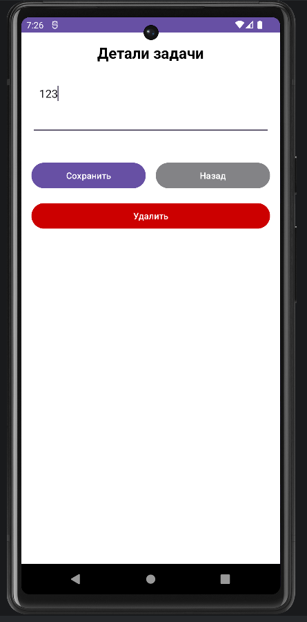

<div align="center">

**МИНИСТЕРСТВО НАУКИ И ВЫСШЕГО ОБРАЗОВАНИЯ РОССИЙСКОЙ ФЕДЕРАЦИИФЕДЕРАЛЬНОЕ ГОСУДАРСТВЕННОЕ БЮДЖЕТНОЕ ОБРАЗОВАТЕЛЬНОЕ УЧРЕЖДЕНИЕ ВЫСШЕГО ОБРАЗОВАНИЯ**  
**«САХАЛИНСКИЙ ГОСУДАРСТВЕННЫЙ УНИВЕРСИТЕТ»**

<br>
<br>

Институт естественных наук и техносферной безопасности  
Кафедра информатики  
Ощепков Алексей

<br>
<br>
<br>
<br>

Лабораторная работа №7  
«Добавление второго экрана.»  
01.03.02 Прикладная математика и информатика  

<br>
<br>
<br>
<br>
<br>
<br>
<br>
<br>
<br>
<br>
<br>
<br>
<br>

<div align="right">
Научный руководитель<br>
Соболев Евгений Игоревич
</div>

<br>
<br>
<br>

г. Южно-Сахалинск  
2026 г.

</div>

---

# Л/р №7

## Добавление второго экрана (детали задачи). Переход по клику на элемент списка.

**Цель работы:** Научиться создавать многоэкранные приложения, осуществлять переход между экранами с передачей данных через Intent, обрабатывать клики на элементах RecyclerView.

---

## 1. Листинг `activity_detail.xml`.

```kotlin
<?xml version="1.0" encoding="utf-8"?>
<androidx.constraintlayout.widget.ConstraintLayout xmlns:android="http://schemas.android.com/apk/res/android"
    xmlns:app="http://schemas.android.com/apk/res-auto"
    xmlns:tools="http://schemas.android.com/tools"
    android:id="@+id/main"
    android:layout_width="match_parent"
    android:layout_height="match_parent"
    tools:context=".DetailActivity">

    <LinearLayout
        xmlns:android="http://schemas.android.com/apk/res/android"
        android:layout_width="match_parent"
        android:layout_height="match_parent"
        android:orientation="vertical"
        android:padding="16dp"
        android:background="@color/white">

        <!-- Заголовок -->
        <TextView
            android:layout_width="wrap_content"
            android:layout_height="wrap_content"
            android:text="@string/detail_title"
            android:textSize="24sp"
            android:textStyle="bold"
            android:textColor="@color/black"
            android:layout_gravity="center"
            android:layout_marginBottom="24dp"/>

        <!-- текст -->
        <TextView
            android:id="@+id/textTaskDetail"
            android:layout_width="match_parent"
            android:layout_height="wrap_content"
            android:textSize="18sp"
            android:textColor="@color/black"
            android:layout_marginBottom="16dp"
            android:visibility="visible"/>

        <!-- поле для ввода -->
        <EditText
            android:id="@+id/editTaskDetail"
            android:layout_width="match_parent"
            android:layout_height="wrap_content"
            android:hint="@string/hint_edit_task"
            android:textSize="18sp"
            android:minLines="3"
            android:gravity="top|start"
            android:padding="12dp"
            android:layout_marginBottom="16dp" />

        <!-- Кнопки -->
        <LinearLayout
            android:layout_width="match_parent"
            android:layout_height="wrap_content"
            android:orientation="horizontal"
            android:gravity="center"
            android:layout_marginTop="24dp">

            <!-- Редактировать -->
            <Button
                android:id="@+id/buttonEditSave"
                android:layout_width="0dp"
                android:layout_height="wrap_content"
                android:layout_weight="1"
                android:text="Редактировать"
                android:backgroundTint="@color/purple"
                android:textColor="@color/white"
                android:layout_marginEnd="8dp"/>

            <!-- Назад -->
            <Button
                android:id="@+id/buttonBack"
                android:layout_width="0dp"
                android:layout_height="wrap_content"
                android:layout_weight="1"
                android:text="@string/button_back"
                android:backgroundTint="@color/light_gray"
                android:textColor="@color/white"
                android:layout_marginStart="8dp"/>
        </LinearLayout>

        <!-- удалить -->
        <Button
            android:id="@+id/buttonDelete"
            android:layout_width="match_parent"
            android:layout_height="wrap_content"
            android:text="@string/button_delete"
            android:backgroundTint="@android:color/holo_red_dark"
            android:textColor="@color/white"
            android:layout_marginTop="16dp"/>

    </LinearLayout>
</androidx.constraintlayout.widget.ConstraintLayout>
```

---

## 2. Листинг `DetailActivity.kt`.

```kotlin
package com.example.todoapp

import android.content.Intent
import android.os.Bundle
import android.widget.Button
import android.widget.EditText
import android.widget.TextView
import android.widget.Toast
import androidx.appcompat.app.AppCompatActivity

class DetailActivity : AppCompatActivity() {

    companion object {
        const val EXTRA_TASK_TEXT = "task_text"
        const val EXTRA_TASK_POSITION = "task_position"
        const val RESULT_KEY_TEXT = "updated_text"
        const val RESULT_KEY_POSITION = "updated_position"
    }

    private lateinit var textTaskDetail: TextView
    private lateinit var editTaskDetail: EditText
    private lateinit var buttonEditSave: Button
    private lateinit var buttonBack: Button
    private lateinit var buttonDelete: Button

    private var isEditMode = false
    private var taskText: String = ""
    private var taskPosition: Int = -1

    override fun onCreate(savedInstanceState: Bundle?) {
        super.onCreate(savedInstanceState)
        setContentView(R.layout.activity_detail)

        textTaskDetail = findViewById(R.id.textTaskDetail)
        buttonBack = findViewById(R.id.buttonBack)
        editTaskDetail = findViewById(R.id.editTaskDetail)
        buttonEditSave = findViewById(R.id.buttonEditSave)
        buttonDelete = findViewById(R.id.buttonDelete)

        taskText = intent.getStringExtra(EXTRA_TASK_TEXT) ?: "Нет данных"
        taskPosition = intent.getIntExtra(EXTRA_TASK_POSITION, -1)
        updateViewMode()

        // Кнопка редактировать - сохранить
        buttonEditSave.setOnClickListener {
            if (isEditMode) {
                // в режиме редактирования - сохранение
                saveTaskChanges()
            } else {
                //в режиме просмотра - переход в режим редактирования
                enableEditMode()
            }
        }

        // Кнопка назад
        buttonBack.setOnClickListener {
            finish()
        }

        // Кнопка удалить
        buttonDelete.setOnClickListener {
            deleteTask()
        }
    }

    //Обновление интерфейса
    private fun updateViewMode() {
        if (isEditMode) {
            // Режим редактирования
            textTaskDetail.visibility = TextView.GONE
            editTaskDetail.visibility = EditText.VISIBLE
            editTaskDetail.setText(taskText)      // Заполнение поле
            buttonEditSave.text = "Сохранить"     // текст кнопки
        } else {
            // Режим просмотра
            textTaskDetail.visibility = TextView.VISIBLE
            editTaskDetail.visibility = EditText.GONE
            textTaskDetail.text = taskText        // Отображение текста
            buttonEditSave.text = "Редактировать"
        }
    }

    // интерфейс в режим редактирования
    private fun enableEditMode() {
        isEditMode = true
        updateViewMode()
    }

    // Сохранение изменений задачи
    private fun saveTaskChanges() {
        val newText = editTaskDetail.text.toString().trim()

        // новый текст не пустой
        if (newText.isNotBlank()) {
            // Intent для возврата результата в MainActivity
            val resultIntent = Intent().apply {
                //передача данных
                putExtra(RESULT_KEY_TEXT, newText)           // Новый текст задачи
                putExtra(RESULT_KEY_POSITION, taskPosition)  // позиция задачи в списке
                putExtra("action_type", "updated")           // обновлено
            }
            // Установка результата и закрытие активности
            setResult(RESULT_OK, resultIntent)
            finish()
            // тост подтверждения
            Toast.makeText(this, "Задача обновлена", Toast.LENGTH_SHORT).show()
        } else {
            // тост ошибки
            Toast.makeText(this, "Введите текст задачи", Toast.LENGTH_SHORT).show()
        }
    }

    // Удаление задачи
    private fun deleteTask() {
        val resultIntent = Intent().apply {
            putExtra(RESULT_KEY_POSITION, taskPosition)  // Позиция задачи в списке
            putExtra("action_type", "deleted")           // удалено
        }
        setResult(RESULT_OK, resultIntent)
        finish()
        // подтверждение удаления
        Toast.makeText(this, R.string.toast_task_deleted, Toast.LENGTH_SHORT).show()
    }
}
```

---

## 3. Листинг `TaskAdapter.kt`.

```kotlin
package com.example.todoapp

import android.graphics.Canvas
import android.view.LayoutInflater
import android.view.View
import android.view.ViewGroup
import android.widget.CheckBox
import android.widget.TextView
import androidx.core.content.ContextCompat
import androidx.recyclerview.widget.ItemTouchHelper
import androidx.recyclerview.widget.RecyclerView
import com.google.android.material.snackbar.Snackbar

class TaskAdapter(private val tasks: MutableList<String>, private val recyclerView: RecyclerView) :
    RecyclerView.Adapter<TaskAdapter.TaskViewHolder>() {

    private var lastDeletedTask: String? = null
    private var lastDeletedPosition: Int = -1

    // ViewHolder
    class TaskViewHolder(itemView: View) : RecyclerView.ViewHolder(itemView) {
        val textTask: TextView = itemView.findViewById(R.id.textTask)
        val checkTask: CheckBox = itemView.findViewById(R.id.checkTask)
    }

    // новый ViewHolder (новый элемент списка)

    override fun onCreateViewHolder(parent: ViewGroup, viewType: Int): TaskViewHolder {
        val view = LayoutInflater.from(parent.context)
            .inflate(R.layout.item_task, parent, false)
        return TaskViewHolder(view)
    }

    // Заполнение ViewHolder данными
    override fun onBindViewHolder(holder: TaskViewHolder, position: Int) {
        val task = tasks[position]
        holder.textTask.text = task

        holder.checkTask.setOnCheckedChangeListener(null)
        holder.checkTask.isChecked = false

        // перечёркивание выполненной задачи
        holder.checkTask.setOnCheckedChangeListener { _, isChecked ->
            if (isChecked) {
                // + флаг перечёркивания текста
                holder.textTask.paintFlags = holder.textTask.paintFlags or android.graphics.Paint.STRIKE_THRU_TEXT_FLAG
            } else {
                // - флаг перечёркивания текста
                holder.textTask.paintFlags = holder.textTask.paintFlags and android.graphics.Paint.STRIKE_THRU_TEXT_FLAG.inv()
            }
        }

        // Лр7
        // Обработка клика на задау
        holder.itemView.setOnClickListener {
            onItemClick?.invoke(position)
        }
    }

    // общее количество элементов в списке
    override fun getItemCount(): Int = tasks.size

    // обновление списка задач после поворота экрана
    fun updateData(newTasks: List<String>) {
        tasks.clear()
        tasks.addAll(newTasks)
        notifyDataSetChanged()
    }

    // Удаляет задачу по позиции
    fun removeTask(position: Int): String {
        val deletedTask = tasks[position]
        tasks.removeAt(position)
        notifyItemRemoved(position)
        lastDeletedTask = deletedTask
        lastDeletedPosition = position
        return deletedTask
    }

    // Восстанавливает последнюю удалённую задачу (отмена в snackbar)
    fun restoreTask() {
        lastDeletedTask?.let { task ->
            if (lastDeletedPosition != -1 && lastDeletedPosition <= tasks.size) {
                tasks.add(lastDeletedPosition, task)
                notifyItemInserted(lastDeletedPosition)
            } else {
                tasks.add(task)
                notifyItemInserted(tasks.size - 1)
            }
        }
        lastDeletedTask = null
        lastDeletedPosition = -1
    }

    // свайп для удаления
    fun enableSwipeToDelete() {
        val swipeCallback = object : ItemTouchHelper.SimpleCallback(0, ItemTouchHelper.LEFT or ItemTouchHelper.RIGHT) {

            //перетаскивание элемента
            override fun onMove(
                recyclerView: RecyclerView,
                viewHolder: RecyclerView.ViewHolder,
                target: RecyclerView.ViewHolder
            ): Boolean = false

            // при завершении свайпа удаление задачи и показ Snackbar
            override fun onSwiped(viewHolder: RecyclerView.ViewHolder, direction: Int) {
                val position = viewHolder.adapterPosition
                removeTask(position)
                showUndoSnackbar(position)
            }

            // красный фон при свайпе
            override fun onChildDraw(
                c: Canvas,
                recyclerView: RecyclerView,
                viewHolder: RecyclerView.ViewHolder,
                dX: Float,
                dY: Float,
                actionState: Int,
                isCurrentlyActive: Boolean
            ) {
                super.onChildDraw(c, recyclerView, viewHolder, dX, dY, actionState, isCurrentlyActive)
                val itemView = viewHolder.itemView
                val background = ContextCompat.getDrawable(
                    recyclerView.context,
                    android.R.color.holo_red_light
                )
                background?.let {
                    if (dX > 0) {
                        // Свайп вправо
                        it.setBounds(0, itemView.top, dX.toInt(), itemView.bottom)
                    } else {
                        // Свайп влево
                        it.setBounds(
                            itemView.width + dX.toInt(),
                            itemView.top,
                            itemView.width,
                            itemView.bottom
                        )
                    }
                    it.draw(c)
                }
            }
        }
        ItemTouchHelper(swipeCallback).attachToRecyclerView(recyclerView)
    }

    // snackbar Отмена
    private fun showUndoSnackbar(position: Int) {
        Snackbar.make(recyclerView, "Задача удалена", Snackbar.LENGTH_LONG)
            .setAction("Отмена") {
                restoreTask()
            }
            .setActionTextColor(ContextCompat.getColor(recyclerView.context, android.R.color.white))
            .setBackgroundTint(ContextCompat.getColor(recyclerView.context, android.R.color.black))
            .show()
    }

    // Лр7
    // Лямбда для обработки клика на элемент списка
    private var onItemClick: ((Int) -> Unit)? = null

    // обработчик клика

    fun setOnItemClick(listener: (Int) -> Unit) {
        onItemClick = listener
    }
}
```

---

## 4. Листинг `MainActivity.kt`.

```kotlin
package com.example.todoapp

import android.content.Intent
import android.os.Bundle
import android.widget.Button
import android.widget.EditText
import android.widget.TextView
import android.widget.Toast
import androidx.appcompat.app.AppCompatActivity
import androidx.recyclerview.widget.LinearLayoutManager
import androidx.recyclerview.widget.RecyclerView

class MainActivity : AppCompatActivity() {

    private var counter = 0
    private val tasks = mutableListOf<String>()
    private lateinit var adapter: TaskAdapter

    override fun onCreate(savedInstanceState: Bundle?) {
        super.onCreate(savedInstanceState)
        setContentView(R.layout.activity_main)

        // Счётчик нажатий
        val textCounter = findViewById<TextView>(R.id.textCounter)
        val buttonIncrement = findViewById<Button>(R.id.buttonIncrement)
        val buttonReset = findViewById<Button>(R.id.buttonReset)

        updateCounterDisplay(textCounter)
        buttonIncrement.setOnClickListener {
            counter++
            updateCounterDisplay(textCounter)
        }
        buttonReset.setOnClickListener {
            counter = 0
            updateCounterDisplay(textCounter)
            Toast.makeText(this, R.string.toast_counter_reset, Toast.LENGTH_SHORT).show()
        }

        // Ввод текста
        val editTextInput = findViewById<EditText>(R.id.editTextInput)
        val buttonShow = findViewById<Button>(R.id.buttonShow)
        val textEntered = findViewById<TextView>(R.id.textEntered)

        buttonShow.setOnClickListener {
            val inputText = editTextInput.text.toString()
            textEntered.text = getString(R.string.label_entered_with_text, inputText)
        }

        // Список
        val editTextTask = findViewById<EditText>(R.id.editTextTask)
        val buttonAddTask = findViewById<Button>(R.id.buttonAddTask)
        val buttonRemoveLast = findViewById<Button>(R.id.buttonRemoveLast)
        val recyclerView = findViewById<RecyclerView>(R.id.recyclerViewTasks)

        // RecyclerView
        recyclerView.layoutManager = LinearLayoutManager(this)
        adapter = TaskAdapter(tasks, recyclerView)
        recyclerView.adapter = adapter
        adapter.enableSwipeToDelete()

        //Лр7 Обработчик клика на элемент списка
        adapter.setOnItemClick { position ->
            openTaskDetail(position)
        }

        // Добавление задачи
        buttonAddTask.setOnClickListener {
            val task = editTextTask.text.toString().trim()
            if (task.isNotBlank()) {
                tasks.add(task)
                adapter.notifyItemInserted(tasks.size - 1)
                editTextTask.text.clear()
            } else {
                Toast.makeText(this, R.string.toast_empty_task, Toast.LENGTH_SHORT).show()
            }
        }

        // Удаление последней задачи
        buttonRemoveLast.setOnClickListener {
            if (tasks.isNotEmpty()) {
                tasks.removeAt(tasks.lastIndex)
                adapter.notifyItemRemoved(tasks.size)
                Toast.makeText(this, R.string.toast_task_removed, Toast.LENGTH_SHORT).show()
            } else {
                Toast.makeText(this, R.string.toast_list_empty, Toast.LENGTH_SHORT).show()
            }
        }

        // Восстановление состояния при повороте
        if (savedInstanceState != null) {
            counter = savedInstanceState.getInt("counter")
            val savedTasks = savedInstanceState.getStringArrayList("tasks")
            if (savedTasks != null) {
                tasks.clear()
                tasks.addAll(savedTasks)
                adapter.updateData(tasks)
            }
            updateCounterDisplay(textCounter)
        }
    }

    private fun updateCounterDisplay(textView: TextView) {
        textView.text = getString(R.string.counter_text, counter)
    }

    override fun onSaveInstanceState(outState: Bundle) {
        super.onSaveInstanceState(outState)
        outState.putInt("counter", counter)
        outState.putStringArrayList("tasks", ArrayList(tasks))
    }

    //Лр7 получение результата от DetailActivity
    private val detailResultLauncher = registerForActivityResult(
        androidx.activity.result.contract.ActivityResultContracts.StartActivityForResult()
    ) { result ->
        if (result.resultCode == RESULT_OK) {
            val actionType = result.data?.getStringExtra("action_type")

            when (actionType) {
                // Задача была обновлена
                "updated" -> {
                    val updatedText = result.data?.getStringExtra(DetailActivity.RESULT_KEY_TEXT)
                    val position = result.data?.getIntExtra(DetailActivity.RESULT_KEY_POSITION, -1) ?: -1
                    if (position != -1 && updatedText != null) {
                        tasks[position] = updatedText
                        adapter.notifyItemChanged(position)
                    }
                }
                // Задача была удалена
                "deleted" -> {
                    val position = result.data?.getIntExtra(DetailActivity.RESULT_KEY_POSITION, -1) ?: -1
                    if (position != -1 && position < tasks.size) {
                        tasks.removeAt(position)
                        adapter.notifyItemRemoved(position)
                    }
                }
            }
        }
    }

    //Лр7 открытие задачи
    private fun openTaskDetail(position: Int) {
        val intent = Intent(this, DetailActivity::class.java).apply {
            putExtra(DetailActivity.EXTRA_TASK_TEXT, tasks[position])
            putExtra(DetailActivity.EXTRA_TASK_POSITION, position)
        }
        detailResultLauncher.launch(intent)
    }
}
```

---

## 5. Скриншоты главного экрана и экрана деталей.

## `Главный экран`.


## `Экран деталей`.


---

## 6. Ответы на контрольные вопросы.

**1. Что такое Intent? Какие виды Intent существуют?**

***Ответ:*** Intent это объект для взаимодействия между компонентами. 

Виды: 
1) Явный (указывает конкретный класс).
2) Неявный (указывает действие).

**2. Как передать данные из одной Activity в другую?**

***Ответ:*** При отправке через `Intent.putExtra("key", value)`. При получении через `intent.getStringExtra("key")`.

**3. Какие способы обработки кликов на элементах RecyclerView вы знаете?**

***Ответ:*** 
1) Лямбда в конструкторе адаптера.
2) `OnClickListener` в `onBindViewHolder`.

**4. Как создать новую Activity в Android Studio?**

***Ответ:*** `File -> New -> Activity -> Empty Activity`.

**5. Для чего используется метод `finish()`?**

***Ответ:*** Чтобы завершить текущую Activity и вернуть пользователя на предыдущий экран.

---

## 7. Вывод по работе.

В ходе выполнения лабораторной работы №7:
1. Реализовал многоэкранное приложение с навигацией через Intent, где по клику на элемент RecyclerView открывается экран деталей задачи.
2. Освоил методы передачи данных между активностями.

Выполнил индивидуальное задание 2.