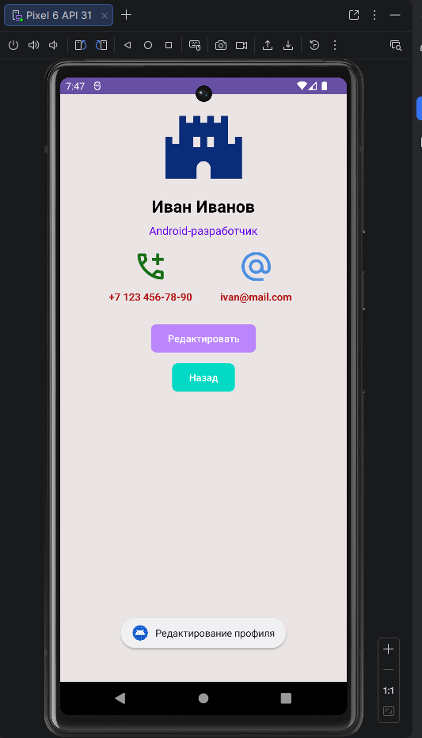

<div align="center">

**МИНИСТЕРСТВО НАУКИ И ВЫСШЕГО ОБРАЗОВАНИЯ РОССИЙСКОЙ ФЕДЕРАЦИИФЕДЕРАЛЬНОЕ ГОСУДАРСТВЕННОЕ БЮДЖЕТНОЕ ОБРАЗОВАТЕЛЬНОЕ УЧРЕЖДЕНИЕ ВЫСШЕГО ОБРАЗОВАНИЯ**  
**«САХАЛИНСКИЙ ГОСУДАРСТВЕННЫЙ УНИВЕРСИТЕТ»**

<br>
<br>

Институт естественных наук и техносферной безопасности  
Кафедра информатики  
Ощепков Алексей

<br>
<br>
<br>
<br>

Лабораторная работа №4  
«Верстка экрана профиля пользователя.»  
01.03.02 Прикладная математика и информатика  

<br>
<br>
<br>
<br>
<br>
<br>
<br>
<br>
<br>
<br>
<br>
<br>
<br>

<div align="right">
Научный руководитель<br>
Соболев Евгений Игоревич
</div>

<br>
<br>
<br>

г. Южно-Сахалинск  
2026 г.

</div>

---

# Л/р №4

## Верстка экрана профиля пользователя (аватар, имя, кнопка «Редактировать»).

**Цель работы:** Освоить создание пользовательского интерфейса в Android с использованием `ConstraintLayout`, изучить основные компоненты: `ImageView`, `TextView`, `Button`. Научиться работать с ресурсами (строки, цвета, размеры) и обрабатывать нажатия кнопок.

---

## 1. Листинг `activity_main.xml` и `MainActivity.kt`.

Листинг `activity_main.xml`.

```kotlin
<?xml version="1.0" encoding="utf-8"?>
<androidx.constraintlayout.widget.ConstraintLayout
    xmlns:android="http://schemas.android.com/apk/res/android"
    xmlns:app="http://schemas.android.com/apk/res-auto"
    xmlns:tools="http://schemas.android.com/tools"
    android:layout_width="match_parent"
    android:layout_height="match_parent"
    android:background="@color/bg_app"
    tools:context=".MainActivity">

    <ImageView
        android:id="@+id/imageAvatar"
        android:layout_width="@dimen/avatar_size"
        android:layout_height="@dimen/avatar_size"
        android:src="@drawable/ic_profile"
        app:layout_constraintTop_toTopOf="parent"
        app:layout_constraintBottom_toTopOf="@+id/textName"
        app:layout_constraintLeft_toLeftOf="parent"
        app:layout_constraintRight_toRightOf="parent"
        android:layout_marginTop="@dimen/margin_normal"
        android:contentDescription="@string/profile_name" />

    <TextView
        android:id="@+id/textName"
        android:layout_width="wrap_content"
        android:layout_height="wrap_content"
        android:text="@string/profile_name"
        android:textSize="@dimen/text_size_name"
        android:textColor="@color/black"
        android:textStyle="bold"
        app:layout_constraintTop_toBottomOf="@id/imageAvatar"
        app:layout_constraintLeft_toLeftOf="parent"
        app:layout_constraintRight_toRightOf="parent"
        android:layout_marginTop="@dimen/margin_small" />

    <TextView
        android:id="@+id/textStatus"
        android:layout_width="wrap_content"
        android:layout_height="wrap_content"
        android:text="@string/profile_status"
        android:textSize="@dimen/text_size_status"
        android:textColor="@color/purple_500"
        app:layout_constraintTop_toBottomOf="@id/textName"
        app:layout_constraintLeft_toLeftOf="parent"
        app:layout_constraintRight_toRightOf="parent"
        android:layout_marginTop="@dimen/margin_small" />

    <LinearLayout
        android:id="@+id/layoutContacts"
        android:layout_width="wrap_content"
        android:layout_height="wrap_content"
        android:orientation="horizontal"
        android:gravity="center"
        app:layout_constraintTop_toBottomOf="@id/textStatus"
        app:layout_constraintStart_toStartOf="parent"
        app:layout_constraintEnd_toEndOf="parent"
        android:layout_marginTop="@dimen/margin_normal">

        <!-- Телефон -->
        <LinearLayout
            android:layout_width="wrap_content"
            android:layout_height="wrap_content"
            android:orientation="vertical"
            android:gravity="center"
            android:layout_marginEnd="@dimen/margin_normal_x2">

            <ImageView
                android:layout_width="@dimen/mail_phone_image_size"
                android:layout_height="@dimen/mail_phone_image_size"
                android:contentDescription="@string/contact_phone"
                android:src="@drawable/ic_phone"
                app:tint="@color/phone" />

            <TextView
                android:id="@+id/textPhone"
                android:layout_width="wrap_content"
                android:layout_height="wrap_content"
                android:text="@string/profile_phone"
                android:textSize="@dimen/mail_phone_txt_size"
                android:textColor="@color/red"
                android:textStyle="bold"
                android:layout_marginTop="@dimen/margin_small"/>
        </LinearLayout>

        <!-- Email -->
        <LinearLayout
            android:layout_width="120dp"
            android:layout_height="wrap_content"
            android:gravity="center"
            android:orientation="vertical">

            <ImageView
                android:layout_width="@dimen/mail_phone_image_size"
                android:layout_height="@dimen/mail_phone_image_size"
                android:contentDescription="@string/contact_email"
                android:src="@drawable/ic_email"
                app:tint="@color/mail" />

            <TextView
                android:id="@+id/textEmail"
                android:layout_width="wrap_content"
                android:layout_height="wrap_content"
                android:layout_marginTop="@dimen/margin_small"
                android:text="@string/profile_email"
                android:textColor="@color/red"
                android:textStyle="bold"
                android:textSize="@dimen/mail_phone_txt_size" />
        </LinearLayout>

    </LinearLayout>

    <Button
        android:id="@+id/buttonEdit"
        android:layout_width="wrap_content"
        android:layout_height="wrap_content"
        android:layout_marginTop="@dimen/margin_big_x1.5"
        android:backgroundTint="@color/purple_200"
        android:text="@string/button_edit"
        app:cornerRadius="@dimen/button_corner_radius"
        app:layout_constraintLeft_toLeftOf="parent"
        app:layout_constraintRight_toRightOf="parent"
        app:layout_constraintTop_toBottomOf="@id/textStatus" />

    <Button
        android:id="@+id/buttonBack"
        android:layout_width="wrap_content"
        android:layout_height="wrap_content"
        android:layout_marginTop="@dimen/margin_small"
        android:backgroundTint="@color/teal_200"
        android:text="@string/button_back"
        app:cornerRadius="@dimen/button_corner_radius"
        app:layout_constraintLeft_toLeftOf="parent"
        app:layout_constraintRight_toRightOf="parent"
        app:layout_constraintTop_toBottomOf="@id/buttonEdit" />

</androidx.constraintlayout.widget.ConstraintLayout>
```

Листинг `MainActivity.kt`

```kotlin
package com.example.profileapp

import androidx.appcompat.app.AppCompatActivity
import android.os.Bundle
import android.widget.Button
import android.widget.Toast

class MainActivity : AppCompatActivity() {
    override fun onCreate(savedInstanceState: Bundle?) {
        super.onCreate(savedInstanceState)
        setContentView(R.layout.activity_main)

        val buttonEdit = findViewById<Button>(R.id.buttonEdit)
        buttonEdit.setOnClickListener {
            Toast.makeText(this, R.string.toast_message, Toast.LENGTH_SHORT).show()
        }

        val buttonBack = findViewById<Button>(R.id.buttonBack)
        buttonBack.setOnClickListener {
            Toast.makeText(this, R.string.toast_message2, Toast.LENGTH_SHORT).show()
        }
    }
}
```

---

## 2. Скриншот работающего приложения.



---

## 3. Ответы на контрольные вопросы.

**1. Для чего используется `ConstraintLayout`? Какие у него преимущества перед `LinearLayout`?**

***Ответ:*** `ConstraintLayout` это менеджер разметки, который используется для позиционирования элементов.

**2. Что такое `app:layout_constraint...` атрибуты?**

***Ответ:*** Это атрибуты привязки, которые закрепляют края виджета к другим элементам или родителю.

**3. Как вынести размеры и цвета в ресурсы? Зачем это нужно?**

***Ответ:*** Создать файлы `colors.xml` (цвета), `dimens.xml` (размеры), `strings.xm` (текст) в `res/values/`. Это нужно для того чтобы был чистый и поддерживаемый код.

**4. Каким образом можно обработать клик на кнопке в Kotlin-коде?**

***Ответ:*** 

Через `setOnClickListener`: 

```kotlin
button.setOnClickListener {
    Toast.makeText(this, "Текст", Toast.LENGTH_SHORT).show()
}
```

**5. Как добавить обработчик нажатия на `ImageView`?**

***Ответ:*** Обработчик добавляется так же, как и для кнопки, через метод `setOnClickListener`.

```kotlin
// Делаем элемент кликабельным
imageView.isClickable = true
imageView.isFocusable = true

imageView.setOnClickListener {
    Toast.makeText(this, "Текст", Toast.LENGTH_SHORT).show()
}
```

---

## 4. Вывод по работе.

В ходе выполнения лабораторной работы №4 я освоил создание пользовательского интерфейса в Android с использованием `ConstraintLayout`. 

Научился: 
1. Размещать виджеты `ImageView`, `TextView`, `Button`;
2. Выносить строки, цвета и размеры в ресурсные файлы `strings.xml`, `colors.xml`, `dimens.xml`;
3. Обрабатывать нажатия кнопок через `setOnClickListener`.

Выполнил индивидуальное задание 1.