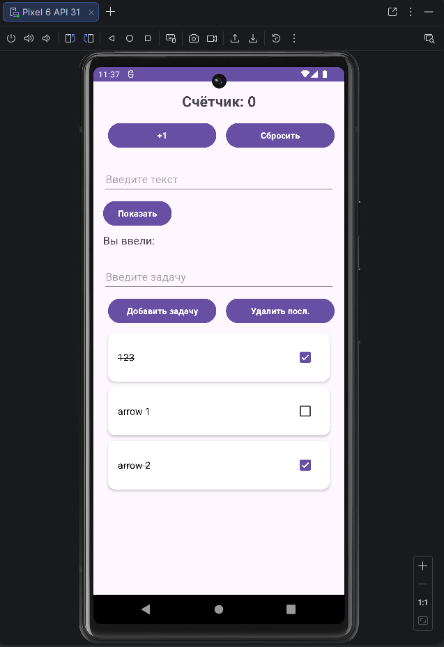

<div align="center">

**МИНИСТЕРСТВО НАУКИ И ВЫСШЕГО ОБРАЗОВАНИЯ РОССИЙСКОЙ ФЕДЕРАЦИИФЕДЕРАЛЬНОЕ ГОСУДАРСТВЕННОЕ БЮДЖЕТНОЕ ОБРАЗОВАТЕЛЬНОЕ УЧРЕЖДЕНИЕ ВЫСШЕГО ОБРАЗОВАНИЯ**  
**«САХАЛИНСКИЙ ГОСУДАРСТВЕННЫЙ УНИВЕРСИТЕТ»**

<br>
<br>

Институт естественных наук и техносферной безопасности  
Кафедра информатики  
Ощепков Алексей

<br>
<br>
<br>
<br>

Лабораторная работа №6  
«Отображение списка задач.»  
01.03.02 Прикладная математика и информатика  

<br>
<br>
<br>
<br>
<br>
<br>
<br>
<br>
<br>
<br>
<br>
<br>
<br>

<div align="right">
Научный руководитель<br>
Соболев Евгений Игоревич
</div>

<br>
<br>
<br>

г. Южно-Сахалинск  
2026 г.

</div>

---

# Л/р №6

## Отображение списка задач из предыдущей лабораторной в красивых карточках.

**Цель работы:** Научиться использовать `RecyclerView` для отображения списка данных, освоить создание адаптера и ViewHolder, применить `CardView` для оформления элементов списка.

---

## 1. Листинг файла `item_task.xml`.

```kotlin
<?xml version="1.0" encoding="utf-8"?>
<androidx.cardview.widget.CardView
    xmlns:android="http://schemas.android.com/apk/res/android"
    xmlns:app="http://schemas.android.com/apk/res-auto"
    android:layout_width="match_parent"
    android:layout_height="wrap_content"
    android:layout_marginHorizontal="8dp"
    android:layout_marginVertical="4dp"
    app:cardCornerRadius="12dp"
    app:cardElevation="3dp"
    app:cardBackgroundColor="@color/white">

    <LinearLayout
        android:layout_width="match_parent"
        android:layout_height="wrap_content"
        android:orientation="horizontal"
        android:padding="16dp"
        android:gravity="center_vertical">

        <!-- Текст задачи -->
        <TextView
            android:id="@+id/textTask"
            android:layout_width="0dp"
            android:layout_height="wrap_content"
            android:layout_weight="1"
            android:textSize="16sp"
            android:textColor="@color/black"/>

        <!-- Чекбокс -->
        <CheckBox
            android:id="@+id/checkTask"
            android:layout_width="wrap_content"
            android:layout_height="wrap_content"
            android:layout_marginStart="12dp"/>

    </LinearLayout>

</androidx.cardview.widget.CardView>
```

---

## 2. Листинг класса `TaskAdapter`.

```kotlin
package com.example.todoapp

import android.graphics.Canvas
import android.view.LayoutInflater
import android.view.View
import android.view.ViewGroup
import android.widget.CheckBox
import android.widget.TextView
import androidx.core.content.ContextCompat
import androidx.recyclerview.widget.ItemTouchHelper
import androidx.recyclerview.widget.RecyclerView
import com.google.android.material.snackbar.Snackbar

class TaskAdapter(private val tasks: MutableList<String>,private val recyclerView: RecyclerView) :
    RecyclerView.Adapter<TaskAdapter.TaskViewHolder>() {

    private var lastDeletedTask: String? = null
    private var lastDeletedPosition: Int = -1

    class TaskViewHolder(itemView: View) : RecyclerView.ViewHolder(itemView) {
        val textTask: TextView = itemView.findViewById(R.id.textTask)
        val checkTask: CheckBox = itemView.findViewById(R.id.checkTask)
    }

    override fun onCreateViewHolder(parent: ViewGroup, viewType: Int): TaskViewHolder {
        val view = LayoutInflater.from(parent.context)
            .inflate(R.layout.item_task, parent, false)
        return TaskViewHolder(view)
    }

    override fun onBindViewHolder(holder: TaskViewHolder, position: Int) {
        val task = tasks[position]
        holder.textTask.text = task

        holder.checkTask.setOnCheckedChangeListener(null)
        holder.checkTask.isChecked = false

        // перечёркивание выполненной задачи
        holder.checkTask.setOnCheckedChangeListener { _, isChecked ->
            if (isChecked) {
                // + флаг перечёркивания текста
                holder.textTask.paintFlags = holder.textTask.paintFlags or android.graphics.Paint.STRIKE_THRU_TEXT_FLAG
            } else {
                // - флаг перечёркивания текста
                holder.textTask.paintFlags = holder.textTask.paintFlags and android.graphics.Paint.STRIKE_THRU_TEXT_FLAG.inv()
            }
        }
    }

    override fun getItemCount(): Int = tasks.size

    // Метод для обновления списка задач после поворота экрана
    fun updateData(newTasks: List<String>) {
        tasks.clear()
        tasks.addAll(newTasks)
        notifyDataSetChanged()
    }

    // Удаляет задачу по позиции
    fun removeTask(position: Int): String {
        val deletedTask = tasks[position]
        tasks.removeAt(position)
        notifyItemRemoved(position)
        lastDeletedTask = deletedTask
        lastDeletedPosition = position
        return deletedTask
    }

    // Восстанавливает последнюю удалённую задачу
    fun restoreTask() {
        lastDeletedTask?.let { task ->
            if (lastDeletedPosition != -1 && lastDeletedPosition <= tasks.size) {
                tasks.add(lastDeletedPosition, task)
                notifyItemInserted(lastDeletedPosition)
            } else {
                tasks.add(task)
                notifyItemInserted(tasks.size - 1)
            }
        }
        lastDeletedTask = null
        lastDeletedPosition = -1
    }

    // свайп для удаления задач
    fun enableSwipeToDelete() {
        val swipeCallback = object : ItemTouchHelper.SimpleCallback(0,ItemTouchHelper.LEFT or ItemTouchHelper.RIGHT)
        {
            override fun onMove(
                recyclerView: RecyclerView,
                viewHolder: RecyclerView.ViewHolder,
                target: RecyclerView.ViewHolder
            ): Boolean = false

            override fun onSwiped(viewHolder: RecyclerView.ViewHolder, direction: Int) {
                val position = viewHolder.adapterPosition
                removeTask(position)
                showUndoSnackbar(position)
            }

            override fun onChildDraw(
                c: Canvas,
                recyclerView: RecyclerView,
                viewHolder: RecyclerView.ViewHolder,
                dX: Float,
                dY: Float,
                actionState: Int,
                isCurrentlyActive: Boolean
            ) {
                super.onChildDraw(c, recyclerView, viewHolder, dX, dY, actionState, isCurrentlyActive)
                val itemView = viewHolder.itemView
                val background = ContextCompat.getDrawable(
                    recyclerView.context,
                    android.R.color.holo_red_light
                )
                background?.let {
                    if (dX > 0) {
                        // Свайп вправо
                        it.setBounds(0, itemView.top, dX.toInt(), itemView.bottom)
                    } else {
                        // Свайп влево
                        it.setBounds(
                            itemView.width + dX.toInt(),
                            itemView.top,
                            itemView.width,
                            itemView.bottom
                        )
                    }
                    it.draw(c)
                }
            }
        }
        ItemTouchHelper(swipeCallback).attachToRecyclerView(recyclerView)
    }

    private fun showUndoSnackbar(position: Int) {
        Snackbar.make(recyclerView, "Задача удалена", Snackbar.LENGTH_LONG)
            .setAction("Отмена") {
                restoreTask()
            }
            .setActionTextColor(ContextCompat.getColor(recyclerView.context, android.R.color.white))
            .setBackgroundTint(ContextCompat.getColor(recyclerView.context, android.R.color.black))
            .show()
    }
}
```

---

## 3. Листинг `MainActivity.kt`.

```kotlin
package com.example.todoapp

import android.os.Bundle
import android.widget.Button
import android.widget.EditText
import android.widget.TextView
import android.widget.Toast
import androidx.appcompat.app.AppCompatActivity
import androidx.recyclerview.widget.LinearLayoutManager
import androidx.recyclerview.widget.RecyclerView

class MainActivity : AppCompatActivity() {

    private var counter = 0
    private val tasks = mutableListOf<String>()
    private lateinit var adapter: TaskAdapter

    override fun onCreate(savedInstanceState: Bundle?) {
        super.onCreate(savedInstanceState)
        setContentView(R.layout.activity_main)

        // Счётчик нажатий
        val textCounter = findViewById<TextView>(R.id.textCounter)
        val buttonIncrement = findViewById<Button>(R.id.buttonIncrement)
        val buttonReset = findViewById<Button>(R.id.buttonReset)

        updateCounterDisplay(textCounter)
        buttonIncrement.setOnClickListener {
            counter++
            updateCounterDisplay(textCounter)
        }
        buttonReset.setOnClickListener {
            counter = 0
            updateCounterDisplay(textCounter)
            Toast.makeText(this, R.string.toast_counter_reset, Toast.LENGTH_SHORT).show()
        }

        // Ввод текста
        val editTextInput = findViewById<EditText>(R.id.editTextInput)
        val buttonShow = findViewById<Button>(R.id.buttonShow)
        val textEntered = findViewById<TextView>(R.id.textEntered)

        buttonShow.setOnClickListener {
            val inputText = editTextInput.text.toString()
            textEntered.text = getString(R.string.label_entered_with_text, inputText)
        }

        // список
        val editTextTask = findViewById<EditText>(R.id.editTextTask)
        val buttonAddTask = findViewById<Button>(R.id.buttonAddTask)
        val buttonRemoveLast = findViewById<Button>(R.id.buttonRemoveLast)
        val recyclerView = findViewById<RecyclerView>(R.id.recyclerViewTasks)

        // RecyclerView
        recyclerView.layoutManager = LinearLayoutManager(this)
        adapter = TaskAdapter(tasks, recyclerView)
        recyclerView.adapter = adapter
        adapter.enableSwipeToDelete() // Свайп для удаления

        // Добавление задачи
        buttonAddTask.setOnClickListener {
            val task = editTextTask.text.toString().trim()
            if (task.isNotBlank()) {
                tasks.add(task)
                adapter.notifyItemInserted(tasks.size - 1)
                editTextTask.text.clear()
            } else {
                Toast.makeText(this, R.string.toast_empty_task, Toast.LENGTH_SHORT).show()
            }
        }

        // Удаление последней задачи
        buttonRemoveLast.setOnClickListener {
            if (tasks.isNotEmpty()) {
                tasks.removeAt(tasks.lastIndex)
                adapter.notifyItemRemoved(tasks.size)
                Toast.makeText(this, R.string.toast_task_removed, Toast.LENGTH_SHORT).show()
            } else {
                Toast.makeText(this, R.string.toast_list_empty, Toast.LENGTH_SHORT).show()
            }
        }

        // Восстановление состояния при повороте
        if (savedInstanceState != null) {
            counter = savedInstanceState.getInt("counter")
            val savedTasks = savedInstanceState.getStringArrayList("tasks")
            if (savedTasks != null) {
                tasks.clear()
                tasks.addAll(savedTasks)
                adapter.updateData(tasks)
            }
            updateCounterDisplay(textCounter)
        }
    }

    private fun updateCounterDisplay(textView: TextView) {
        textView.text = getString(R.string.counter_text, counter)
    }

    override fun onSaveInstanceState(outState: Bundle) {
        super.onSaveInstanceState(outState)
        outState.putInt("counter", counter)
        outState.putStringArrayList("tasks", ArrayList(tasks))
    }
}
```

---

## 4. Скриншот работающего приложения.



---

## 5. Ответы на контрольные вопросы.

**1. Для чего нужен `RecyclerView`? Чем он лучше `ListView`?**

***Ответ:*** `RecyclerView` нужен для эффективного отображения больших списков за счёт переиспользования элементов. Его преимущество в том, что он экономит память.

**2. Какие компоненты необходимы для работы `RecyclerView`?**

***Ответ:*** 
1) `LayoutManager` — расположение элементов (линия, сетка).
2) `Adapter` — создаёт элементы списка и связывает данные с View.
3) `ViewHolder` — кэширует ссылки на элементы карточки.

**3. Что такое `ViewHolder` и для чего он используется?**

***Ответ:*** `ViewHolder` это класс, хранящий ссылки на Views внутри элемента списка..

**4. Чем отличается `notifyDataSetChanged()` от `notifyItemInserted()`?**

***Ответ:*** `notifyDataSetChanged()` - перерисовывает весь список. А `notifyItemInserted()` - перерисовывает только новую позицию, а не весь список.

**5. Как добавить обработку кликов на элементы `RecyclerView`?**

***Ответ:*** Через интерфейс в адаптере или `setOnClickListener`.

---

## 6. Вывод по работе.

В ходе выполнения лабораторной работы №6: 

1. Освоил отображение списков с использованием `RecyclerView` и `CardView`.
2. Реализовал адаптер `TaskAdapter`.
3. Изучил методы обновления данных (`notifyItemInserted`, `notifyItemRemoved`).

Выполнил индивидуальное задание 1.